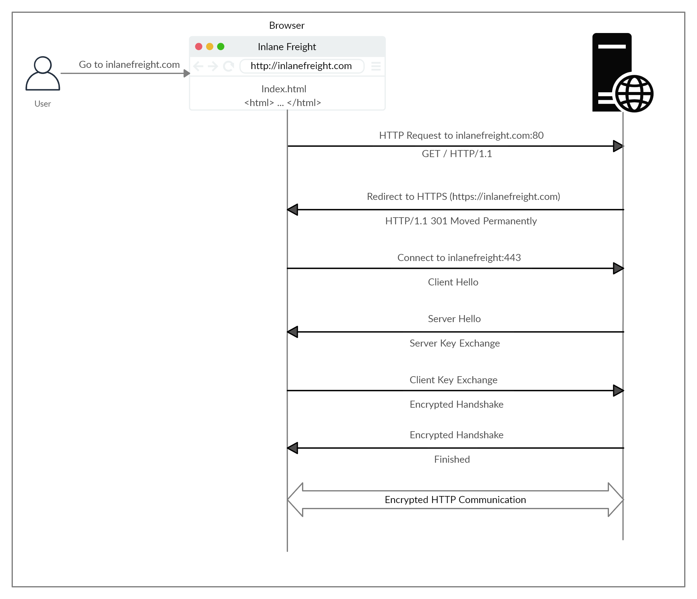

# Hypertext Transfer Protocol Secure (HTTPS)

> Note: Although the data transferred through the HTTPS protocol may be encrypted, the request may still reveal the visited URL if it contacted a clear-text DNS server. For this reason, it is recommended to utilize encrypted DNS servers (e.g. 8.8.8.8 or 1.1.1.1), or utilize a VPN service to ensure all traffic is properly encrypted.

## HTTPS Flow

<figure><figcaption></figcaption></figure>

## cURL for HTTPS

```bash
eldeim@htb[/htb]$ curl -k https://inlanefreight.com

<!DOCTYPE HTML PUBLIC "-//IETF//DTD HTML 2.0//EN">
<html><head>
...SNIP...
```
