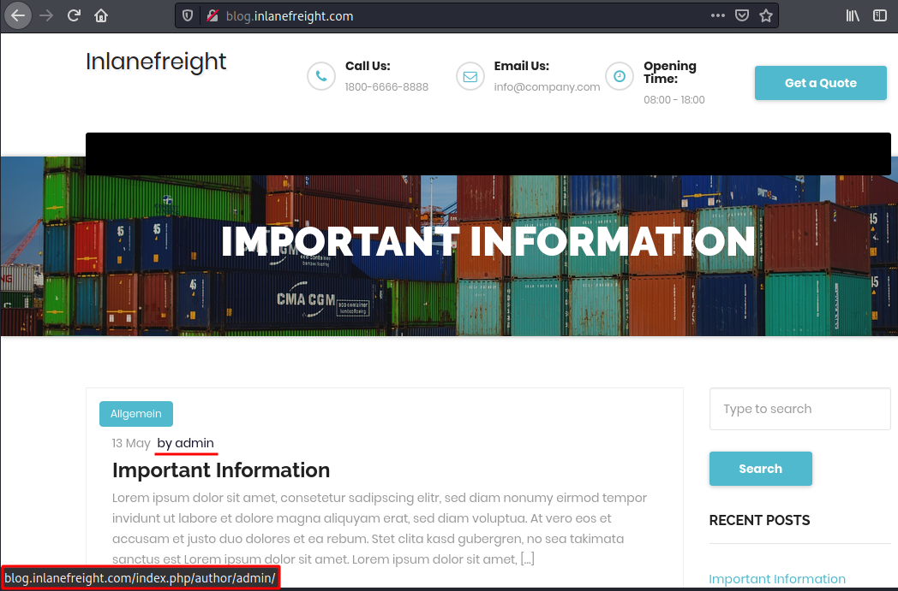

# Enumeration

## **WP Version - Source Code**

```html
...SNIP...
<link rel='https://api.w.org/' href='http://blog.inlanefreight.com/index.php/wp-json/' />
<link rel="EditURI" type="application/rsd+xml" title="RSD" href="http://blog.inlanefreight.com/xmlrpc.php?rsd" />
<link rel="wlwmanifest" type="application/wlwmanifest+xml" href="http://blog.inlanefreight.com/wp-includes/wlwmanifest.xml" /> 
<meta name="generator" content="WordPress 5.3.3" />
...SNIP...
```

```shell-session
eldeim@htb[/htb]$ curl -s -X GET http://blog.inlanefreight.com | grep '<meta name="generator"'

<meta name="generator" content="WordPress 5.3.3" />
```

In older WordPress versions, another source for uncovering version information is the `readme.html` file in WordPress's root directory.

## Plugins and Themes Enumeration

### **Plugins**

```shell-session
eldeim@htb[/htb]$ curl -s -X GET http://blog.inlanefreight.com | sed 's/href=/\n/g' | sed 's/src=/\n/g' | grep 'wp-content/plugins/*' | cut -d"'" -f2

http://blog.inlanefreight.com/wp-content/plugins/wp-google-places-review-slider/public/css/wprev-public_combine.css?ver=6.1
http://blog.inlanefreight.com/wp-content/plugins/mail-masta/lib/subscriber.js?ver=5.3.3
http://blog.inlanefreight.com/wp-content/plugins/mail-masta/lib/jquery.validationEngine-en.js?ver=5.3.3
http://blog.inlanefreight.com/wp-content/plugins/mail-masta/lib/jquery.validationEngine.js?ver=5.3.3
http://blog.inlanefreight.com/wp-content/plugins/wp-google-places-review-slider/public/js/wprev-public-com-min.js?ver=6.1
http://blog.inlanefreight.com/wp-content/plugins/mail-masta/lib/css/mm_frontend.css?ver=5.3.3
```

### Themes

```shell-session
eldeim@htb[/htb]$ curl -s -X GET http://blog.inlanefreight.com | sed 's/href=/\n/g' | sed 's/src=/\n/g' | grep 'themes' | cut -d"'" -f2

http://blog.inlanefreight.com/wp-content/themes/ben_theme/css/bootstrap.css?ver=5.3.3
http://blog.inlanefreight.com/wp-content/themes/ben_theme/style.css?ver=5.3.3
http://blog.inlanefreight.com/wp-content/themes/ben_theme/css/colors/default.css?ver=5.3.3
http://blog.inlanefreight.com/wp-content/themes/ben_theme/css/jquery.smartmenus.bootstrap.css?ver=5.3.3
http://blog.inlanefreight.com/wp-content/themes/ben_theme/css/owl.carousel.css?ver=5.3.3
http://blog.inlanefreight.com/wp-content/themes/ben_theme/css/owl.transitions.css?ver=5.3.3
```

To speed up enumeration, we could also write a simple bash script or use a tool such as `wfuzz` or `WPScan`, which automate the process.

## Directory Indexing

### Common Rutes

* /wp-content/plugins/{name\_plugin}
* /wp-content/themes/{name\_theme}
* /wp-content/uploads

The following example shows a disabled plugin.


If we browse to the plugins directory, we can see that we still have access to the `Mail Masta` plugin.

<figure><figcaption></figcaption></figure>

We can also view the directory listing using cURL and convert the HTML output to a nice readable format using `html2text`.

&#x20; Directory Indexing

```shell-session
eldeim@htb[/htb]$ curl -s -X GET http://blog.inlanefreight.com/wp-content/plugins/mail-masta/ | html2text

****** Index of /wp-content/plugins/mail-masta ******
[[ICO]]       Name                 Last_modified    Size Description
===========================================================================
[[PARENTDIR]] Parent_Directory                         -  
[[DIR]]       amazon_api/          2020-05-13 18:01    -  
[[DIR]]       inc/                 2020-05-13 18:01    -  
[[DIR]]       lib/                 2020-05-13 18:01    -  
[[   ]]       plugin-interface.php 2020-05-13 18:01  88K  
[[TXT]]       readme.txt           2020-05-13 18:01 2.2K  
===========================================================================
     Apache/2.4.29 (Ubuntu) Server at blog.inlanefreight.com Port 80
```

## User Enumeration

### First Method

The `admin` user is usually assigned the user ID `1`. We can confirm this by specifying the user ID for the `author` parameter in the URL.

```
http://blog.inlanefreight.com/?author=1
```

<figure><figcaption></figcaption></figure>

This can also be done with `cURL` from the command line. The HTTP response in the below output shows the author that corresponds to the user ID. The URL in the `Location` header confirms that this user ID belongs to the `admin` user.

#### **Existing User**

```shell-session
eldeim@htb[/htb]$ curl -s -I http://blog.inlanefreight.com/?author=1

HTTP/1.1 301 Moved Permanently
Date: Wed, 13 May 2020 20:47:08 GMT
Server: Apache/2.4.29 (Ubuntu)
X-Redirect-By: WordPress
Location: http://blog.inlanefreight.com/index.php/author/admin/
Content-Length: 0
Content-Type: text/html; charset=UTF-8
```

The above `cURL` request then redirects us to the user's profile page or the main login page. If the user does not exist, we receive a `404 Not Found error`.

#### **Non-Existing User**

```shell-session
eldeim@htb[/htb]$ curl -s -I http://blog.inlanefreight.com/?author=100

HTTP/1.1 404 Not Found
Date: Wed, 13 May 2020 20:47:14 GMT
Server: Apache/2.4.29 (Ubuntu)
Expires: Wed, 11 Jan 1984 05:00:00 GMT
Cache-Control: no-cache, must-revalidate, max-age=0
Link: <http://blog.inlanefreight.com/index.php/wp-json/>; rel="https://api.w.org/"
Transfer-Encoding: chunked
Content-Type: text/html; charset=UTF-8
```

### Second Method

#### **JSON Endpoint**

```shell-session
eldeim@htb[/htb]$ curl http://blog.inlanefreight.com/wp-json/wp/v2/users | jq

[
  {
    "id": 1,
    "name": "admin",
    "url": "",
    "description": "",
    "link": "http://blog.inlanefreight.com/index.php/author/admin/",
    <SNIP>
  },
  {
    "id": 2,
    "name": "ch4p",
    "url": "",
    "description": "",
    "link": "http://blog.inlanefreight.com/index.php/author/ch4p/",
    <SNIP>
  },
<SNIP>
```

## Login

### **cURL - POST Request**

```shell-session
eldeim@htb[/htb]$ curl -X POST -d "<methodCall><methodName>wp.getUsersBlogs</methodName><params><param><value>admin</value></param><param><value>CORRECT-PASSWORD</value></param></params></methodCall>" http://blog.inlanefreight.com/xmlrpc.php

<?xml version="1.0" encoding="UTF-8"?>
<methodResponse>
  <params>
    <param>
      <value>
      <array><data>
  <value><struct>
  <member><name>isAdmin</name><value><boolean>1</boolean></value></member>
  <member><name>url</name><value><string>http://blog.inlanefreight.com/</string></value></member>
  <member><name>blogid</name><value><string>1</string></value></member>
  <member><name>blogName</name><value><string>Inlanefreight</string></value></member>
  <member><name>xmlrpc</name><value><string>http://blog.inlanefreight.com/xmlrpc.php</string></value></member>
</struct></value>
</data></array>
      </value>
    </param>
  </params>
</methodResponse>
```

If the credentials are not valid, we will receive a `403 faultCode` error.

#### **Invalid Credentials - 403 Forbidden**

```shell-session
eldeim@htb[/htb]$ curl -X POST -d "<methodCall><methodName>wp.getUsersBlogs</methodName><params><param><value>admin</value></param><param><value>asdasd</value></param></params></methodCall>" http://blog.inlanefreight.com/xmlrpc.php

<?xml version="1.0" encoding="UTF-8"?>
<methodResponse>
  <fault>
    <value>
      <struct>
        <member>
          <name>faultCode</name>
          <value><int>403</int></value>
        </member>
        <member>
          <name>faultString</name>
          <value><string>Incorrect username or password.</string></value>
        </member>
      </struct>
    </value>
  </fault>
</methodResponse>
```

These last few sections introduced several methods for performing manual enumeration against a WordPress instance

## WPScan

The `--enumerate` flag is used to enumerate various components of the WordPress application such as plugins, themes, and users. By default, WPScan enumerates vulnerable plugins, themes, users, media, and backups

> Note: The default number of threads used is 5, however, this value can be changed using the "-t" flag.

```shell-session
eldeim@htb[/htb]$ wpscan --url http://blog.inlanefreight.com --enumerate --api-token Kffr4fdJzy9qVcTk<SNIP>

[+] URL: http://blog.inlanefreight.com/       
...SNIP...                                            

```
