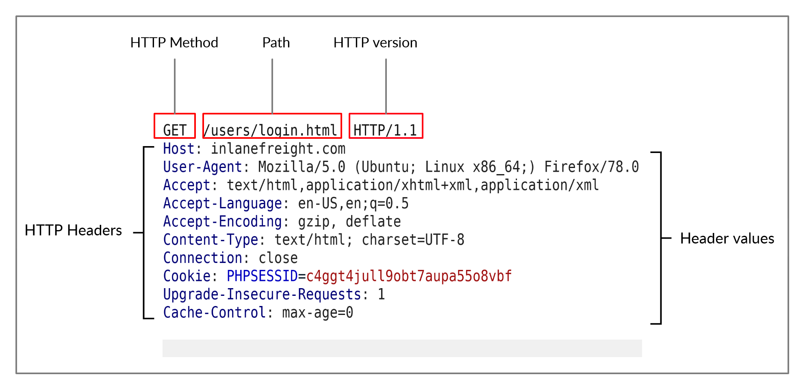
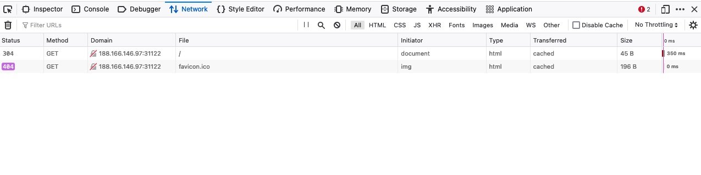

# HTTP Requests and Responses

<figure><figcaption></figcaption></figure>

> Note: HTTP version 1.X sends requests as clear-text, and uses a new-line character to separate different fields and different requests. HTTP version 2.X, on the other hand, sends requests as binary data in a dictionary form.

## HTTP Response & Browser DevTools

As we can see, this time, we get the full HTTP request and response. The request simply sent `GET / HTTP/1.1` along with the `Host`, `User-Agent` and `Accept` headers. In return, the HTTP response contained the `HTTP/1.1 401 Unauthorized`, which indicates that we do not have access over the requested resource, as we will see in an upcoming section. Similar to the request, the response also contained several headers sent by the server, including `Date`, `Content-Length`, and `Content-Type`. Finally, the response contained the response body in HTML, which is the same one we received earlier when using cURL without the `-v` flag.

> Exercise: The `-vvv` flag shows an even more verbose output. Try to use this flag to see what extra request and response details get displayed with it.

<figure><figcaption></figcaption></figure>

The devtools show us at a glance the response status (i.e. response code), the request method used (`GET`), the requested resource (i.e. URL/domain), along with the requested path. Furthermore, we can use `Filter URLs` to search for a specific request, in case the website loads too many to go through.
