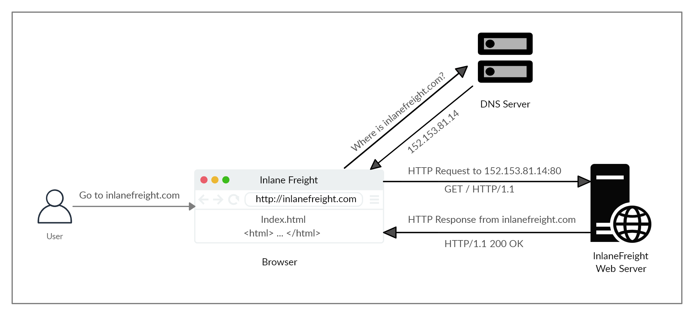

# HyperText Transfer Protocol (HTTP)

<figure><figcaption></figcaption></figure>

## HTTP Flow

<figure><figcaption></figcaption></figure>

> Note: Our browsers usually first look up records in the local '`/etc/hosts`' file, and if the requested domain does not exist within it, then they would contact other DNS servers. We can use the '`/etc/hosts`' to manually add records to for DNS resolution, by adding the IP followed by the domain name.

## cURL

### Basic cURL

In this module, we will be sending web requests through two of the most important tools for any web penetration tester, a Web Browser, like Chrome or Firefox, and the `cURL` command line tool.

|  `curl -h`                                                                                                        | cURL help menu                                       |
| ----------------------------------------------------------------------------------------------------------------- | ---------------------------------------------------- |
|  `curl inlanefreight.com`                                                                                         | Basic GET request                                    |
|  `curl -s -O inlanefreight.com/index.html`                                                                        | Download file                                        |
|  `curl -k https://inlanefreight.com`                                                                              | Skip HTTPS (SSL) certificate validation              |
|  `curl inlanefreight.com -v`                                                                                      | Print full HTTP request/response details             |
|  `curl -I https://www.inlanefreight.com`                                                                          | Send HEAD request (only prints response headers)     |
|  `curl -i https://www.inlanefreight.com`                                                                          | Print response headers and response body             |
|  `curl https://www.inlanefreight.com -A 'Mozilla/5.0'`                                                            | Set User-Agent header                                |
|  `curl -u admin:admin http://<SERVER_IP>:<PORT>/`                                                                 | Set HTTP basic authorization credentials             |
|  `curl http://admin:admin@<SERVER_IP>:<PORT>/`                                                                    | Pass HTTP basic authorization credentials in the URL |
|  `curl -H 'Authorization: Basic YWRtaW46YWRtaW4=' http://<SERVER_IP>:<PORT>/`                                     | Set request header                                   |
|  `curl 'http://<SERVER_IP>:<PORT>/search.php?search=le'`                                                          | Pass GET parameters                                  |
|  `curl -X POST -d 'username=admin&password=admin' http://<SERVER_IP>:<PORT>/`                                     | Send POST request with POST data                     |
|  `curl -b 'PHPSESSID=c1nsa6op7vtk7kdis7bcnbadf1' http://<SERVER_IP>:<PORT>/`                                      | Set request cookies                                  |
|  `curl -X POST -d '{"search":"london"}' -H 'Content-Type: application/json' http://<SERVER_IP>:<PORT>/search.php` | Send POST request with JSON data                     |

### APIs

|  `curl http://<SERVER_IP>:<PORT>/api.php/city/london`                                                                                                    | Read entry            |
| -------------------------------------------------------------------------------------------------------------------------------------------------------- | --------------------- |
|  `curl -s http://<SERVER_IP>:<PORT>/api.php/city/ \| jq`                                                                                                 | Read all entries      |
|  `curl -X POST http://<SERVER_IP>:<PORT>/api.php/city/ -d '{"city_name":"HTB_City", "country_name":"HTB"}' -H 'Content-Type: application/json'`          | Create (add) entry    |
|  `curl -X PUT http://<SERVER_IP>:<PORT>/api.php/city/london -d '{"city_name":"New_HTB_City", "country_name":"HTB"}' -H 'Content-Type: application/json'` | Update (modify) entry |
|  `curl -X DELETE http://<SERVER_IP>:<PORT>/api.php/city/New_HTB_City`                                                                                    | Delete entry          |
