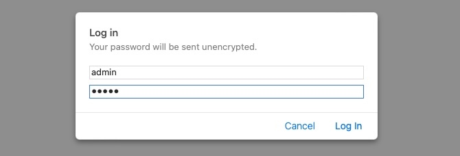
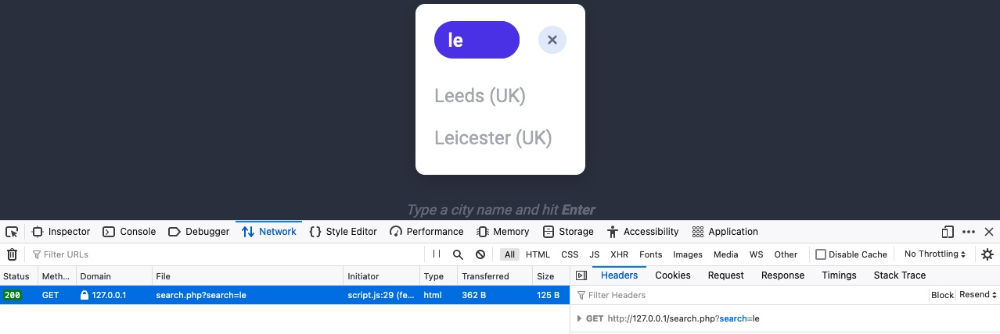
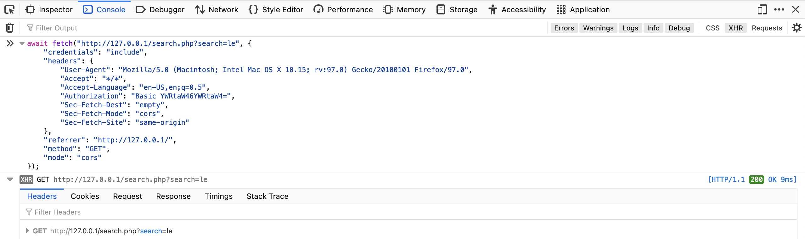

# GET

## HTTP Basic Auth

&#x20;Unlike the usual login forms, which utilize HTTP parameters to validate the user credentials (e.g. POST request), this type of authentication utilizes a `basic HTTP authentication`, which is handled directly by the webserver to protect a specific page/directory, without directly interacting with the web application.

To access the page, we have to enter a valid pair of credentials, which are `admin`:`admin` in this case:

<figure><figcaption></figcaption></figure>

Once we enter the credentials, we would get access to the page:

<figure><figcaption></figcaption></figure>

Let's try to access the page with cURL, and we'll add `-i` to view the response headers:

```gettext
eldeim@htb[/htb]$ curl -i http://<SERVER_IP>:<PORT>/
HTTP/1.1 401 Authorization Required
Date: Mon, 21 Feb 2022 13:11:46 GMT
Server: Apache/2.4.41 (Ubuntu)
Cache-Control: no-cache, must-revalidate, max-age=0
WWW-Authenticate: Basic realm="Access denied"
Content-Length: 13
Content-Type: text/html; charset=UTF-8

Access denied
```

As we can see, we get `Access denied` in the response body, and we also get `Basic realm="Access denied"` in the `WWW-Authenticate` header, which confirms that this page indeed uses `basic HTTP auth`, as discussed in the Headers section. To provide the credentials through cURL, we can use the `-u` flag, as follows:

```bash
eldeim@htb[/htb]$ curl -u admin:admin http://<SERVER_IP>:<PORT>/
<!DOCTYPE html>
<html lang="en">

<head>
...SNIP...

####

eldeim@htb[/htb]$ curl http://admin:admin@<SERVER_IP>:<PORT>/
<!DOCTYPE html>
<html lang="en">

<head>
...SNIP...
```

There is another method we can provide the `basic HTTP auth` credentials, which is directly through the URL as (`username:password@URL`), as we discussed in the first section. If we try the same with cURL or our browser, we do get access to the page

## HTTP Authorization Header

If we add the `-v` flag to either of our earlier cURL commands:

```shell-session
eldeim@htb[/htb]$ curl -v http://admin:admin@<SERVER_IP>:<PORT>/

*   Trying <SERVER_IP>:<PORT>...
* Connected to <SERVER_IP> (<SERVER_IP>) port PORT (#0)
* Server auth using Basic with user 'admin'
> GET / HTTP/1.1
> Host: <SERVER_IP>
> Authorization: Basic YWRtaW46YWRtaW4=
> User-Agent: curl/7.77.0
> Accept: */*
> 
* Mark bundle as not supporting multiuse
< HTTP/1.1 200 OK
< Date: Mon, 21 Feb 2022 13:19:57 GMT
< Server: Apache/2.4.41 (Ubuntu)
< Cache-Control: no-store, no-cache, must-revalidate
< Expires: Thu, 19 Nov 1981 08:52:00 GMT
< Pragma: no-cache
< Vary: Accept-Encoding
< Content-Length: 1453
< Content-Type: text/html; charset=UTF-8
< 

<!DOCTYPE html>
<html lang="en">

<head>
...SNIP...
```

As we are using `basic HTTP auth`, we see that our HTTP request sets the `Authorization` header to `Basic YWRtaW46YWRtaW4=`, which is the base64 encoded value of `admin:admin`. If we were using a modern method of authentication (e.g. `JWT`), the `Authorization` would be of type `Bearer` and would contain a longer encrypted token.

Let's try to manually set the `Authorization`, without supplying the credentials, to see if it does allow us access to the page. We can set the header with the `-H` flag, and will use the same value from the above HTTP request. We can add the `-H` flag multiple times to specify multiple headers:

```shell-session
eldeim@htb[/htb]$ curl -H 'Authorization: Basic YWRtaW46YWRtaW4=' http://<SERVER_IP>:<PORT>/

<!DOCTYPE html
<html lang="en">

<head>
...SNIP...
```

## GET Parameters

Once we are authenticated, we get access to a `City Search` function, in which we can enter a search term and get a list of matching cities:

<figure><figcaption></figcaption></figure>

We can enter any search term and hit enter, and we will immediately notice a new request being sent to the backend:

<figure><figcaption></figcaption></figure>

Now, we can send the same request directly to `search.php` to get the full search results, though it will probably return them in a specific format (e.g. JSON) without having the HTML layout shown in the above screenshot.

```shell-session
eldeim@htb[/htb]$ curl 'http://<SERVER_IP>:<PORT>/search.php?search=le' -H 'Authorization: Basic YWRtaW46YWRtaW4='

Leeds (UK)
Leicester (UK)
```

> Note: The copied command will contain all headers used in the HTTP request. However, we can remove most of them and only keep necessary authentication headers, like the `Authorization` header.

We can also repeat the exact request right within the browser devtools, by selecting `Copy>Copy as Fetch`. This will copy the same HTTP request using the JavaScript Fetch library.

<figure><figcaption></figcaption></figure>
