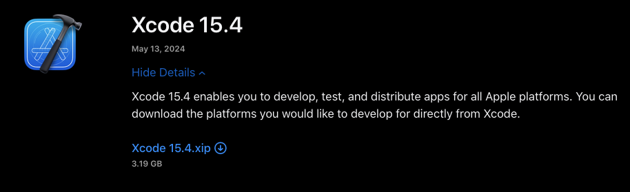

# iOS Penetration Tester

## iOS Testing Setup

### Hardware Requirements

<figure><figcaption></figcaption></figure>

#### Hardware alternatives

<figure><figcaption></figcaption></figure>

***

### Software Setup

<figure><figcaption></figcaption></figure>

<figure><figcaption></figcaption></figure>

<figure><figcaption></figcaption></figure>

***

## Host Software Setup

To follow along with this course, you will need to have either MacOS or any Linux distribution. Windows can be used as well with WSL however there can be some issues with device connectivity. \
\
Hardware / device requirements regarding the iPhone will be covered in the next sections:<br>

* [Mobile Hacking Lab Device setup](https://www.mobilehackinglab.com/path-player?courseid=ios-appsec\&unit=66dee0a8e0d02c8199018fe9)
* [iOS Physical Device Setup](https://www.mobilehackinglab.com/path-player?courseid=ios-appsec\&unit=66320172d9155074010d39bb)
* [iOS Simulator Setup](https://www.mobilehackinglab.com/path-player?courseid=ios-appsec\&unit=66dec02bdeced7b0cb071133)

### Operation System requirements <a href="#el_1727983090324_335" id="el_1727983090324_335"></a>

As an iOS developer you need MacOS (formerly OS-X) with Xcode, the default IDE from Apple which only runs on MacOS, to be able to build and deploy apps to the app store.\
\
**As a mobile penetration tester / researcher MacOS is not a hard requirement.**\
\
The are some limitations if you are not on MacOS, like using an iOS simulator (part of XCode), which is not possible, but for this course we will mainly use cross-platform tools which will run on Mac, Linux and some tools also on Windows.

### Linux <a href="#el_1727985268249_662" id="el_1727985268249_662"></a>

You can use a Linux distribution like Ubuntu or [Kali Linux](https://www.kali.org/), or it might be a good idea to use the [Mobile Hacking lab VM](https://www.mobilehackinglab.com/path-player?courseid=android-appsec\&unit=6616db97ea6610651a09a1bf), used in the Android Application Security course to create one 'Mobile Hacking VM'.

### MacOS <a href="#el_1726506291843_344" id="el_1726506291843_344"></a>

MacOS is designed for Apple devices like Mac Books (and currently the ARM processor like the M1/M2/M3, is the way to go, with the same architecture as iOS).\
If you don't have the hardware you can build a Hackintosh. It is worth mentioning here that a Hackintosh is a grey area and Apple is not very fond of people doing it. As of writing, Apple has the following terms in its bug bounty program which is a subject to change on Apple's will:\
\
&#xNAN;_&#x41; participant in the Apple Security Bounty program will not be deemed to be in breach of applicable Apple license provisions which provide that a user of Apple software may not copy, decompile, reverse engineer, disassemble, attempt to derive the source code of, decrypt, modify, or create derivative works of such Apple software, for in-scope actions performed by that participant where all of the following are met:_\
\
&#x20;   _The actions were performed strictly during participation in the Apple Security Bounty program;_\
&#x20;   _The actions were performed during good-faith security research, which was — or was intended to be — responsibly reported to Apple; and_\
&#x20;   _Neither the actions nor the participant have otherwise violated or exceeded the scope of these terms and conditions._&#x4B;eeping Apple's terms and conditions in mind, you should only use any Hackintosh if you are participating in Apple's [bug bounty program](https://security.apple.com/). We are not a legal advisor but as per our understanding, the terms and conditions might not give a rebate to someone who wishes to only learn.

### Docker-OSX <a href="#el_1724254138218_426" id="el_1724254138218_426"></a>

If you don't have a MacOS device you can also use Docker-OSX  created by sickcodes. Given you are only using it for security research. It is also important to point out that the terms sickcodes has mentioned [here](https://sick.codes/is-hackintosh-osx-kvm-or-docker-osx-legal/) are old and the terms of bug bounty program is already changed. So it is best to confirm with the Terms available on Apple's bug bounty program page before continuing.\
\
Docker-OSX only works in Linux and Windows is not supported. It is recommended to run Linux distro directly instead of a virtual machine as a virtual machine won't be able to handle the graphical needs of MacOS running on docker.\
\
To run Docker-OSX you will need:\
1\. A linux distro preferrably any Debian or Fedora based.\
2\. Atleast 40 GB of empty space (20 GB for container, 20 GB for original image)\
3\. Docker\
\
Download and Install Docker by following the guide specific to your operating system from: [https://docs.docker.com/engine/install/](https://docs.docker.com/engine/install/)\
\
Once docker has been installed, make sure the docker daemon is running:

```
sudo systemctl start docker
```

And then pull and start the Docker-OSX:

```
sudo docker pull sickcodes/docker-osx:auto
```

```
sudo docker run -it --device /dev/kvm -p 50922:10022 -v /tmp/.X11-unix:/tmp/.X11-unix -e "DISPLAY=${DISPLAY:-:0.0}" -e GENERATE_UNIQUE=true sickcodes/docker-osx:auto
```

Once started, login with username "user" and password "alpine"\
\
Further ahead we will not be able to instruct on this setup as Hackintosh can have limited functionalities as well as can violate Apple's terms ie. you are on your own from here.

### XCode (only applicable for MacOS) <a href="#el_1724255842385_341" id="el_1724255842385_341"></a>

* XCode is the only IDE used for building applications for iOS and other platforms offered by Apple. While we are not going to build iOS applications, XCode comes with tools such as Simulator, lldb with iOS support and otool which are also useful in testing the app's security.

\
XCode can be installed directly from the App Store: [https://apps.apple.com/us/app/xcode/id497799835](https://apps.apple.com/us/app/xcode/id497799835)\
\
If installation from App Store is not working for any reason, you can download XCode from: [https://developer.apple.com/download/all/?q=Xcode%2015](https://developer.apple.com/download/all/?q=Xcode%2015) (Sign in Required).<br>

*   Simply search for Xcode 15 and download the xip file<br>

    <figure><figcaption></figcaption></figure>
* After download xip file, simply open it and it will show the option to drag and drop to install XCode.

\
To avoid any issue, we will use the latest stable through out this course. As of writing, XCode 15.4 is the latest stable available while XCode 16 beta 6 is in beta testing.\
\
If you do not have access to MacOS and you only need MacOS to compile binaries for iOS, you can setup cross compiling with [Theos](https://theos.dev/docs/). Installation instructions for Theos can be found at [https://theos.dev/docs/installation-linux](https://theos.dev/docs/installation-linux)<br>

### Connect XCode to Mobile Hacking Lab's Virtual Device  <a href="#el_1725529977565_338" id="el_1725529977565_338"></a>

To connect to the virtual device provided in any iOS lab, first open any iOS lab provided by us and go to Connect tab<br>

<figure><figcaption></figcaption></figure>

Next download the OVPN File provided and scroll down to see download options for USBFlux and download the appropriate version of USBFlux.<br>

<figure><figcaption></figcaption></figure>

If you are using mac, the installation is pretty straightforward with drag n drop. For Linux, you can follow the instructions provided at [https://github.com/corellium/usbfluxd?tab=readme-ov-file#installation](https://github.com/corellium/usbfluxd?tab=readme-ov-file#installation)\
Next step is to connect to the VPN. For this you can utilize OpenVPN Connect or Tunnelblick in MacOS. In Linux,\
Once connected, you will see the device in the Manage Run Destinations window of XCode. The pin is 000000, wait for a while and it should start uploading build cache to the device. If it does not do anything, restart the XCode.

> Note that this process is kinda cumbersome and USBFlux might hang your computer. In any case your mac stops responding, just force quit and restart the device. Also, once connected to the VPN, your internet will stop working and only lab device can be connected to. A solution to this issue is to connect to the VPN only when you need to do anything on the device.&#x20;

***

## iOS Testing Setup

### iOS Physical Device Setup

<figure><figcaption></figcaption></figure>

### iOS Simulator Setup

<figure><figcaption></figcaption></figure>

### Corellium Device Setup

<figure><figcaption></figcaption></figure>
