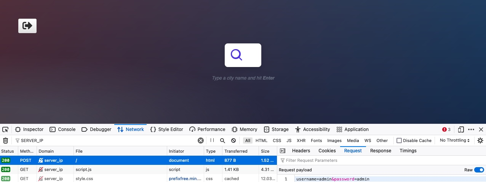
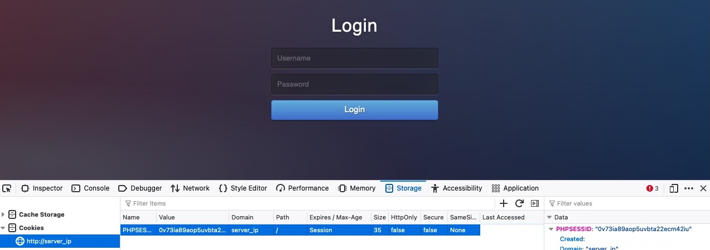
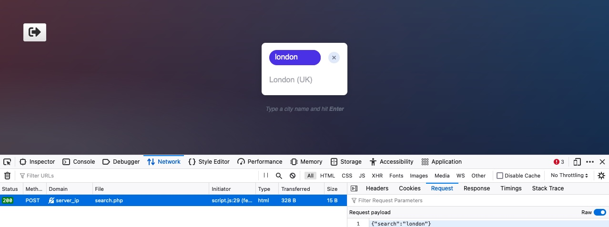
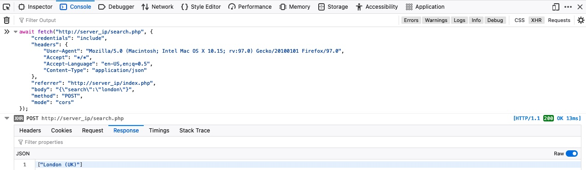

# POST

## Login POST

We visit the web application, we see that it utilizes a PHP login form instead of HTTP basic auth:

<figure><figcaption></figcaption></figure>

We get in and see a similar search function to the one we saw earlier in the GET section. If we clear the Network tab in our browser devtools and try to log in again, we will see many requests being sent. We can filter the requests by our server IP, so it would only show requests going to the web application's web server (i.e. filter out external requests), and we will notice the following POST request being sent:

<figure><figcaption></figcaption></figure>

We can click on the request, click on the `Request` tab (which shows the request body), and then click on the `Raw` button to show the raw request data

```bash
username=admin&password=admin
```

We will use the `-X POST` flag to send a `POST` request. Then, to add our POST data, we can use the `-d` flag and add the above data after it, as follows:

```shell-session
eldeim@htb[/htb]$ curl -X POST -d 'username=admin&password=admin' http://<SERVER_IP>:<PORT>/

...SNIP...
        <em>Type a city name and hit <strong>Enter</strong></em>
...SNIP...
```

> Tip: Many login forms would redirect us to a different page once authenticated (e.g. /dashboard.php). If we want to follow the redirection with cURL, we can use the `-L` flag.

## Authenticated Cookies

If we were successfully authenticated, we should have received a cookie so our browsers can persist our authentication, and we don't need to login every time we visit the page. We can use the `-v` or `-i` flags to view the response, which should contain the `Set-Cookie` header with our authenticated cookie:

```shell-session
eldeim@htb[/htb]$ curl -X POST -d 'username=admin&password=admin' http://<SERVER_IP>:<PORT>/ -i

HTTP/1.1 200 OK
Date: 
Server: Apache/2.4.41 (Ubuntu)
Set-Cookie: PHPSESSID=c1nsa6op7vtk7kdis7bcnbadf1; path=/

...SNIP...
        <em>Type a city name and hit <strong>Enter</strong></em>
```

With our authenticated cookie, we should now be able to interact with the web application without needing to provide our credentials every time. To test this, we can set the above cookie with the `-b` flag in cURL, as follows:

```shell-session
eldeim@htb[/htb]$ curl -b 'PHPSESSID=c1nsa6op7vtk7kdis7bcnbadf1' http://<SERVER_IP>:<PORT>/

...SNIP...
        <em>Type a city name and hit <strong>Enter</strong></em>
...SNIP...
```

<figure><figcaption></figcaption></figure>

We can right-click on the cookie and select `Delete All`, and the click on the `+` icon to add a new cookie. After that, we need to enter the cookie name, which is the part before the `=` (`PHPSESSID`), and then the cookie value, which is the part after the `=` (`c1nsa6op7vtk7kdis7bcnbadf1`).&#x20;

## JSON Data

We will go to the Network tab in the browser devtools, and then click on the trash icon to clear all requests. Then, we can make any search query to see what requests get sent:

<figure><figcaption></figcaption></figure>

As we can see, the search form sends a POST request to `search.php`, with the following data:

```json
{"search":"london"}
```

The POST data appear to be in JSON format, so our request must have specified the `Content-Type` header to be `application/json`. We can confirm this by right-clicking on the request, and selecting `Copy>Copy Request Headers`:

```bash
POST /search.php HTTP/1.1
Host: server_ip
User-Agent: Mozilla/5.0 (Macintosh; Intel Mac OS X 10.15; rv:97.0) Gecko/20100101 Firefox/97.0
Accept: */*
Accept-Language: en-US,en;q=0.5
Accept-Encoding: gzip, deflate
Referer: http://server_ip/index.php
Content-Type: application/json
Origin: http://server_ip
Content-Length: 19
DNT: 1
Connection: keep-alive
Cookie: PHPSESSID=c1nsa6op7vtk7kdis7bcnbadf1

```

Let's try to replicate this request as we did earlier, but include both the cookie and content-type headers, and send our request to `search.php` :&#x20;

```shell-session
eldeim@htb[/htb]$ curl -X POST -d '{"search":"london"}' -b 'PHPSESSID=c1nsa6op7vtk7kdis7bcnbadf1' -H 'Content-Type: application/json' http://<SERVER_IP>:<PORT>/search.php
["London (UK)"]
```

Repeat the same above request by using `Fetch`, as we did in the previous section. We can right-click on the request and select `Copy>Copy as Fetch`, and then go to the `Console` tab and execute our code there:

<figure><figcaption></figcaption></figure>
