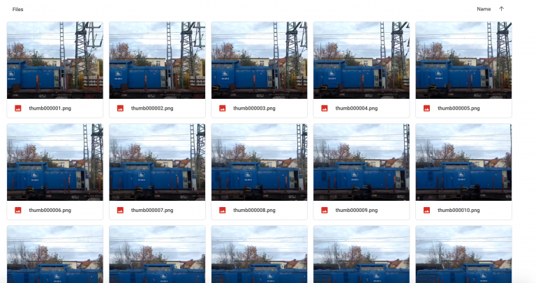

# FFmpeg - Geolocating Videos

Geolocalizar videos no es tan diferente de geolocalizar imágenes

Al fin y al cabo, un video son fotogramas de imágenes encascados para producir una ilusion visual de que es un video...

INFO : [FFmeg](https://ffmpeg.org/)

***

## Installation

```bash
sudo apt install ffmpeg
```

***

## Usage

```bash
ffmpeg <global options> <input file options> -i  <input file> <output file options> <output file>.
```

FFMPEG puede hacer todo tipo de tareas útiles; convertir formatos de video, redimensionar video, añadir audio, eliminar audio, añadir subtítulos, dividir y fusionar video, y muchas otras cosas

> Pero no voy a cubrirlas todas en esta guía.

También es importante recordar que, como la mayoría de las herramientas de línea de comandos, FFMPEG asume que ya estás en la carpeta donde está tu archivo de vídeo de destino

Si no, puedes especificar la ruta al archivo después con `-i`

***

### Grabbing Frames

<figure><figcaption></figcaption></figure>

Capturar fotogramas de un vídeo permite utilizar técnicas de imagen inversa, así como realizar una evaluación fotograma a fotograma de un vídeo.&#x20;

Es mucho más eficaz que intentar pausar un vídeo en el punto adecuado y esperar encontrar lo que se busca. Para capturar todos los fotogramas de un vídeo, utilice el siguiente comando:

```bash
ffmpeg -i myvideo.mp4 img%06d.png -hide_banner
```

* `-i` Le dice a ffmpeg cuál es el nombre del archivo de entrada, es decir, el vídeo con el que va a trabajar.
* `img. %06d S`gnifica que img irá seguido de seis dígitos. Así, el primer fotograma será img000001.png, luego img000002.png, etc. `%04d` sería sólo cuatro dígitos, y así sucesivamente.&#x20;
* `.png` indica a ffmpeg el formato en el que quieres que estén las imágenes.&#x20;
  * Si prefiere jpeg, use `.jpg`
* `-hide_banner` Suprime un montón de texto innecesario cuando ejecutas el comando

***

### Grabbing Audio

Tambien te permite sacar el sonido de un video, para escucharlo y trabjarlo por serparado

```
ffmpeg -i myvideo.mp4 -vn soundtrack.mp3
```
