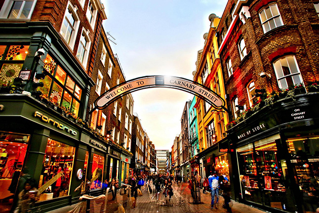

# Image & Geospatial Intelligence

<figure><figcaption></figcaption></figure>

## Questions

Antes de utilizar cualquier herramienta tenemos que evaluar usando nuestros ojos que vemos

* Hay algún dato obvio en la imagen que revele la ubicación, como el nombre de una calle o los rótulos de una tienda?&#x20;
* Puedes saber el país o la región de la imagen, por ejemplo, por qué lado de la carretera circulan, el idioma o características arquitectónicas que puedan revelar un país o continente/región?
* Reconoce estilos de señalización vial, características de la naturaleza y el medio ambiente, o marcas o tipos de vehículos populares?&#x20;
* Cómo es la calidad de las infraestructuras visibles? La carretera está asfaltada o se ven caminos de tierra?&#x20;
* Ves algún punto de referencia único, edificios, puentes, estatuas o montañas que puedan ayudarte a geolocalizar la imagen

> La imagen de arriba es `Carnaby Street`

## Tools

* Busca en Google!!!!!!!!
  * Google Dorking:
    * [DorkSearch](https://dorksearch.com/)
    * [DorkGPT](https://www.dorkgpt.com/)
    * [OSINTCurios](https://www.osintcurio.us/2019/12/20/google-dorks/)
* Extensiones Reverse Images
  * RevEye
    * **Chrome:** [RevEye Reverse Image Search](https://chrome.google.com/webstore/search/RevEye%20Reverse%20Image%20Search?hl=no)
    * **Firefox:** [RevEye Reverse Image Search](https://addons.mozilla.org/nb-NO/firefox/addon/reveye-ris/)
